## Smart Contracts Lib

Discover our extensive library of open-source smart contracts in Ink!, tailored for real business needs. With comprehensive documentation, empower your projects and innovate with confidence.

```mermaid
graph TD
    A["🗃️ <b style='color:#4CAF50;'>Content Ownership</b><br><br>Manage ownership of digital content"]
    B["🤝 <b style='color:#4CAF50;'>Escrow</b><br><br>Secure exchange of assets between parties"]
    C["🎁 <b style='color:#4CAF50;'>Giftcard</b><br><br>Create a giftcard with native tokens"]

    click A "3007" "Content Ownership"
    click B "3004" "Escrow"
    click C "3001" "Giftcard"
```

```mermaid
graph TD
    D["👋 <b style='color:#4CAF50;'>Hello World</b><br><br>Simple lock and unlock assets contract"]
    E["🛒 <b style='color:#4CAF50;'>Marketplace</b><br>Build a NFT marketplace to buy and sell NFTs"]
    F["🖼️ <b style='color:#4CAF50;'>Minting Machine</b><br><br>Mint NFT with auto-incrementing token"]
    
    click D "3005" "Hello World"
    click E "3009" "Marketplace"
    click F "3008" "Minting Machine"
```

