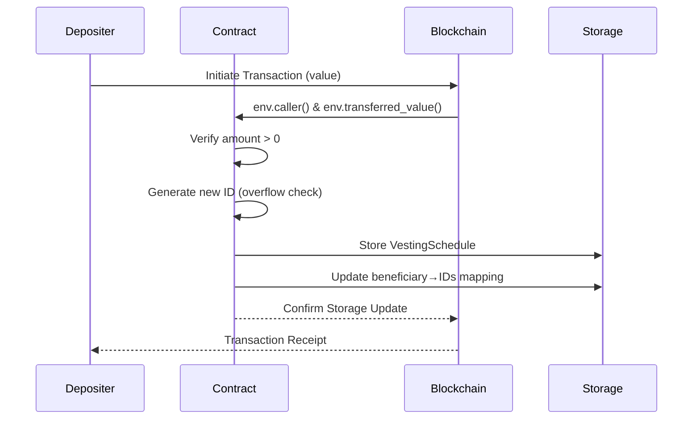
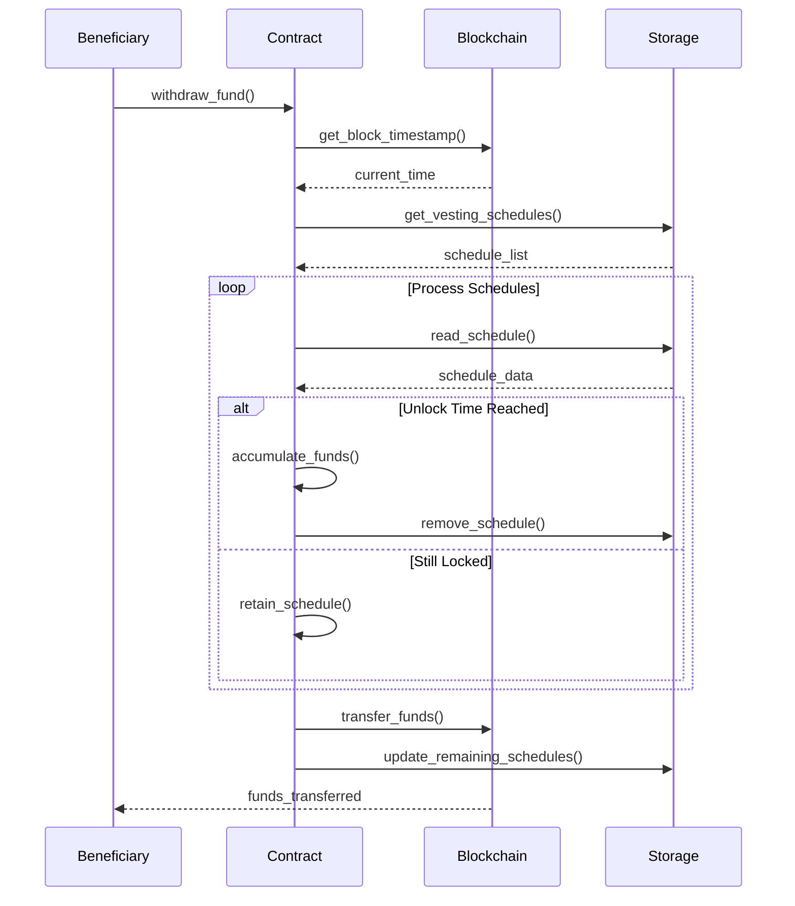

## Building a simple Vesting Contract (in Ink!)

This Ink! smart contract enables an entity (e.g., an employer) to lock funds for a beneficiary (e.g., an employee) until a specified timestamp is reached. Funds can be deposited into multiple schedules and later withdrawn by the beneficiary once the unlock time occurs. Key features include:

- **Time-Locked Deposits**: Funds locked until specified timestamps
- **Multi-Beneficiary Support**: Manage multiple payment schedules
- **Transparent Tracking**: On-chain proof of committed funds
- **Secure Withdrawals**: Automated time-based release

### Time Calculation

When funds are deposited, an `unlock_time` (a UNIX timestamp) is recorded. During withdrawal, the contract reads the current block timestamp with `self.env().block_timestamp()`. If the current time equals or exceeds the unlock time, the funds are eligible for withdrawal.

- **Block Timestamp**: Each block contains creation time (milliseconds since UNIX epoch)
- **Deterministic Execution**: Contracts only access current block's timestamp
- **Reliability:**: Relying on the blockchain’s timestamp ensures that the schedule is enforced transparently and securely.

### Data Structures

The contract uses two primary storage mappings:

- **Schedules Mapping (ID to Schedule):** Each `VestingSchedule` holds the owner, beneficiary, deposited amount, and unlock time.
- **Beneficiary Lookup:** A mapping from beneficiary to a list of schedule IDs allows quick access to all vesting schedules associated with a given account.

An auto-incrementing `id` guarantees unique identifiers for each new schedule, with proper overflow checks.

| Component | Type | Purpose |
|-----------|------|---------|
| `id` | `u64` | Auto-incrementing schedule ID |
| `schedules` | `Mapping<u64, VestingSchedule>` | ID → Schedule lookup |
| `beneficiary_to_ids` | `Mapping<AccountId, Vec<u64>>` | Beneficiary → Schedule IDs |

## Core Functionality

### Deposit and Withdrawal Mechanics

### Deposit Process (`deposit_fund`)

1. **Validate Deposit:**  
   - The caller provides funds (non-zero) along with the beneficiary and unlock time.
2. **Generate and Store Schedule:**  
   - A unique schedule ID is generated. A new vesting schedule is created and stored.
3. **Update Beneficiary Data:**  
   - The schedule ID is appended to the beneficiary’s list for future reference.



#### Withdrawal Process (`withdraw_fund`)

1. **Fetch Schedules:**  
   - The beneficiary calls the function, which retrieves all their schedule IDs.
2. **Check Unlock Conditions:**  
   - For each schedule, if `unlock_time` ≤ current block timestamp, its funds are aggregated and the schedule is removed.
3. **Transfer Funds:**  
   - If any funds are unlocked, they are transferred to the beneficiary; otherwise, an error is returned.



### Full Implementation

_lib.rs_

```rust
#![cfg_attr(not(feature = "std"), no_std, no_main)]

// Mark this module as an ink! smart contract
#[ink::contract]
mod vesting {
    use ink::prelude::vec::Vec;
    use ink::storage::Mapping;

    //----------------------------------
    // Error Handling
    //----------------------------------
    /// Custom error types for the vesting contract
    #[derive(Debug, PartialEq, Eq, scale::Encode, scale::Decode)]
    #[cfg_attr(feature = "std", derive(scale_info::TypeInfo))]
    pub enum Error {
        ZeroAmount = 0, // When trying to deposit 0 value
        NoFundsAvailable = 1, // When no funds are available for withdrawal
        TransferFailed = 2, // When token transfer fails
        IdOverflow = 3, // When schedule ID overflows
    }

    /// Type alias for Result that uses our custom Error
    pub type Result<T> = core::result::Result<T, Error>;

    //----------------------------------
    // Contract Storage
    //----------------------------------
    #[ink(storage)]
    pub struct Vesting {
        // Auto-incrementing ID for vesting schedules
        id: u64,
        // Mapping from schedule ID to vesting details
        schedules: Mapping<u64, VestingSchedule>,
        // Mapping from beneficiary to their schedule IDs
        beneficiary_to_ids: Mapping<AccountId, Vec<u64>>,
    }

    //----------------------------------
    // Default Implementation
    //----------------------------------
    /// Provides default initialization values for the contract
    impl Default for Vesting {
        fn default() -> Self {
            Self {
                id: 0,
                schedules: Mapping::new(),
                beneficiary_to_ids: Mapping::new(),
            }
        }
    }

    //----------------------------------
    // Vesting Schedule Structure
    //----------------------------------
    /// Represents a single vesting schedule
    #[derive(Debug, Clone, scale::Encode, scale::Decode)]
    #[cfg_attr(
        feature = "std",
        derive(
            scale_info::TypeInfo, // Required for metadata generation
            ink::storage::traits::StorageLayout // Required for storage mapping
        )
    )]
    struct VestingSchedule {
        owner: AccountId, // Who created the vesting schedule
        beneficiary: AccountId, // Who can claim the funds
        amount: Balance, // Amount to be vested
        unlock_time: Timestamp, // When funds become available for withdrawal
    }

    //----------------------------------
    // Core Contract Logic
    //----------------------------------
    impl Vesting {
        /// Constructor that initializes the contract
        #[ink(constructor)]
        pub fn new() -> Self {
            Self::default()
        }

        /// Deposit funds into a vesting schedule.
        ///
        /// # Arguments
        ///
        /// * `beneficiary`: The account that will receive the vested funds.
        /// * `unlock_time`: The timestamp when the funds will be unlocked.
        ///
        /// # Errors
        ///
        /// Returns `Error::ZeroAmount` if the deposited amount is zero.
        /// Returns `Error::IdOverflow` if the schedule ID counter overflows.
        #[ink(message, payable)]
        pub fn deposit_fund(
            &mut self,
            beneficiary: AccountId,
            unlock_time: Timestamp
        ) -> Result<()> {
            // Get the caller and transferred amount
            let owner = self.env().caller();
            let amount = self.env().transferred_value();

            // Prevent zero-value deposits
            if amount == 0 {
                return Err(Error::ZeroAmount);
            }

            // Generate new schedule ID with overflow check
            // Without this check, if id reaches 18,446,744,073,709,551,615 (u64::MAX)
            // Adding 1 would wrap to 0 (integer overflow)
            let id = self.id;
            self.id = id.checked_add(1).ok_or(Error::IdOverflow)?;

            // Create new vesting schedule
            let schedule = VestingSchedule {
                owner,
                beneficiary,
                amount,
                unlock_time,
            };

            // Store the schedule
            self.schedules.insert(id, &schedule);

            // Update beneficiary's schedule list
            let mut ids = self.beneficiary_to_ids.get(beneficiary).unwrap_or_default();
            ids.push(id);
            self.beneficiary_to_ids.insert(beneficiary, &ids);

            Ok(())
        }

        /// Withdraw all available vested funds for the caller.
        ///
        /// # Errors
        ///
        /// Returns `Error::NoFundsAvailable` if no funds are available for withdrawal.
        /// Returns `Error::TransferFailed` if the token transfer fails.
        #[ink(message)]
        pub fn withdraw_fund(&mut self) -> Result<()> {
            // Get caller and current block time
            let beneficiary = self.env().caller();
            let current_time: Timestamp = self.env().block_timestamp();

            // Retrieve all schedule IDs for beneficiary
            let ids = self.beneficiary_to_ids.get(beneficiary).unwrap_or_default();
            let mut total_amount: u128 = 0;
            let mut remaining_ids = Vec::new();

            // Process each schedule
            for &id in &ids {
                if let Some(schedule) = self.schedules.get(id) {
                    if schedule.unlock_time <= current_time {
                        // Add to total if unlocked, remove schedule
                        total_amount = total_amount
                            .checked_add(schedule.amount)
                            .ok_or(Error::TransferFailed)?;
                        self.schedules.remove(id);
                    } else {
                        // Keep locked schedules
                        remaining_ids.push(id);
                    }
                }
            }

            // Check if any funds are available
            if total_amount == 0 {
                return Err(Error::NoFundsAvailable);
            }

            // Update remaining schedule IDs
            self.beneficiary_to_ids.insert(beneficiary, &remaining_ids);

            // Transfer funds to beneficiary
            self
                .env()
                .transfer(beneficiary, total_amount)
                .map_err(|_| Error::TransferFailed)?;

            Ok(())
        }
    }

    //----------------------------------
    // Tests here
    //----------------------------------
    
}

```

_Cargo.toml_

```toml
[[package]
name = "vesting"
version = "0.1.0"
authors = ["[your_name] <[your_email]>"]
edition = "2021"

[dependencies]
ink = { version = "5.1.1", default-features = false }
scale = { package = "parity-scale-codec", version = "3.7.4", default-features = false, features = ["derive"] }
scale-info = { version = "2.11.6", default-features = false, features = ["derive"], optional = true }
[dev-dependencies]
ink_e2e = { version = "5.1.1" }

[lib]
name = "vesting"
path = "lib.rs"

[features]
default = ["std"]
std = [
    "ink/std",
    "scale-info/std",
    "scale/std",
]
ink-as-dependency = []
e2e-tests = []
```

### Test Scenarios

```rust
    #[cfg(test)]
    mod tests {
        use super::*;
        use ink::env::{
            test::{
                default_accounts,
                set_caller,
                set_value_transferred,
                set_block_timestamp,
                get_account_balance,
            },
            DefaultEnvironment,
        };

        /// Tests the scenario where the schedule ID counter overflows.
        ///
        /// This test verifies that:
        /// 1. When the `id` counter reaches its maximum value (u64::MAX).
        /// 2. Attempting to create a new vesting schedule results in an `Error::IdOverflow`.
        #[ink::test]
        fn test_id_overflow() {
            // Arrange
            let accounts = default_accounts::<DefaultEnvironment>();
            let unlocktime = 242208000;
            let mut vesting = Vesting::new();
            ink::env::debug_println!("---- initial id: {}", vesting.id);

            vesting.id = u64::MAX; // Set id to the maximum value
            ink::env::debug_println!("---- maximum id: {}", vesting.id);

            set_caller::<DefaultEnvironment>(accounts.alice);
            set_value_transferred::<DefaultEnvironment>(100);

            // Act
            let result = vesting.deposit_fund(accounts.bob, unlocktime);

            // Assert
            assert_eq!(result, Err(Error::IdOverflow));
        }

        /// Tests the scenario where a beneficiary attempts to withdraw funds before the unlock time.
        ///
        /// This test verifies that:
        /// 1. Funds are deposited into a vesting schedule with a future unlock time.
        /// 2. When the beneficiary attempts to withdraw funds before the unlock time.
        /// 3. The `withdraw_fund` function returns `Err(Error::NoFundsAvailable)`.
        #[ink::test]
        fn test_withdraw_before_unlock() {
            // Arrange
            let accounts = default_accounts::<DefaultEnvironment>();
            let initial_time: Timestamp = 242208000;
            let unlock_time_attempt: Timestamp = initial_time + 1000; // Unlock in the future
            let amount: Balance = 100;

            // Set the initial caller to Alice (the owner)
            set_caller::<DefaultEnvironment>(accounts.alice);
            set_block_timestamp::<ink::env::DefaultEnvironment>(initial_time);
            let mut contract = Vesting::new();

            // Act
            // Simulate a deposit of `amount` tokens from Alice to Bob, with a future unlock time
            set_value_transferred::<ink::env::DefaultEnvironment>(amount);
            assert_eq!(contract.deposit_fund(accounts.bob, unlock_time_attempt), Ok(()));
            
            // Set Bob as the caller (the beneficiary)
            set_caller::<DefaultEnvironment>(accounts.bob);
            // Attempt to withdraw before unlock
            let result = contract.withdraw_fund();

            // Assert
            // Verify that the withdrawal fails with the expected error
            assert_eq!(result, Err(Error::NoFundsAvailable));
        }

        /// Tests the successful withdrawal of funds after the unlock period has passed with multiple vestings.
        ///
        /// This test verifies that:
        /// 1. Multiple funds can be deposited into different vesting schedules for the same beneficiary.
        /// 2. Each vesting can have different deposited amount and unlock time
        /// 3. Funds cannot be withdrawn before the unlock time.
        /// 4. All funds can be successfully withdrawn after the unlock time.
        /// 5. The withdrawn amount is the sum of all deposited amounts.
        #[ink::test]
        fn tesst_successful_withdrawal_after_unlock() {
            // Arrange
            // Get test accounts
            let accounts = default_accounts::<DefaultEnvironment>();
            // Define initial timestamp
            let initial_time: Timestamp = 242208000;
            // Define unlock timestamps for each vesting
            let unlock_time_1: Timestamp = 1820044800; //50 years later
            let unlock_time_2: Timestamp = 1851580800; //51 years later
            let unlock_time_3: Timestamp = 1883116800; //52 years later
            // Define the amount of tokens to transfer for each vesting
            let amount_1: Balance = 100;
            let amount_2: Balance = 200;
            let amount_3: Balance = 300;
            // Calculate the total amount
            let total_amount: Balance = amount_1 + amount_2 + amount_3;

            // Set the initial caller to Alice (the owner)
            set_caller::<DefaultEnvironment>(accounts.alice);
            // Set the initial block timestamp
            set_block_timestamp::<ink::env::DefaultEnvironment>(initial_time);
            // Instantiate the vesting contract
            let mut contract = Vesting::new();

            // Act
            // Simulate multiple deposits from Alice to Bob, with different unlock times
            set_value_transferred::<ink::env::DefaultEnvironment>(amount_1);
            assert_eq!(contract.deposit_fund(accounts.bob, unlock_time_1), Ok(()));

            set_value_transferred::<ink::env::DefaultEnvironment>(amount_2);
            assert_eq!(contract.deposit_fund(accounts.bob, unlock_time_2), Ok(()));

            set_value_transferred::<ink::env::DefaultEnvironment>(amount_3);
            assert_eq!(contract.deposit_fund(accounts.bob, unlock_time_3), Ok(()));

            // Advance the block timestamp to a time after all unlocks
            set_block_timestamp::<ink::env::DefaultEnvironment>(unlock_time_3 + 1);

            // Set the caller to Bob (the beneficiary)
            set_caller::<DefaultEnvironment>(accounts.bob);

            // Get Bob's initial balance
            let initial_balance = get_account_balance::<DefaultEnvironment>(accounts.bob).expect(
                "Failed to get initial balance"
            );

            // Attempt to withdraw the funds, which should now be unlocked
            assert_eq!(contract.withdraw_fund(), Ok(()));

            // Get Bob's final balance
            let final_balance = get_account_balance::<DefaultEnvironment>(accounts.bob).expect(
                "Failed to get final balance"
            );

            // Assert
            // Check if the difference between the final and initial balance is equal to the total amount
            assert_eq!(final_balance - initial_balance, total_amount);
        }
    }
```
