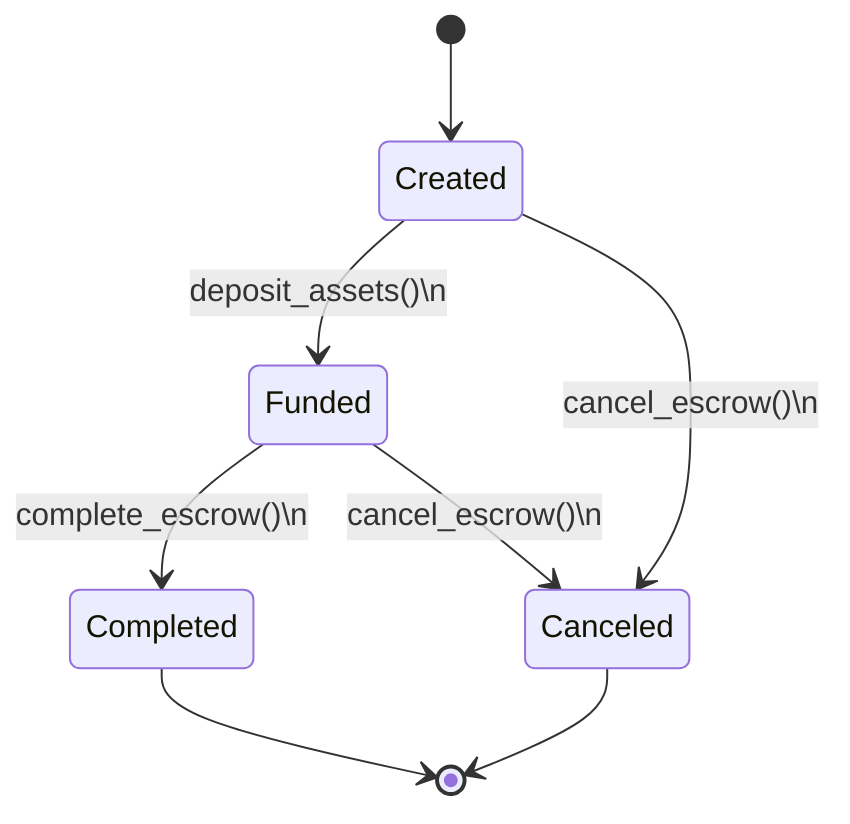
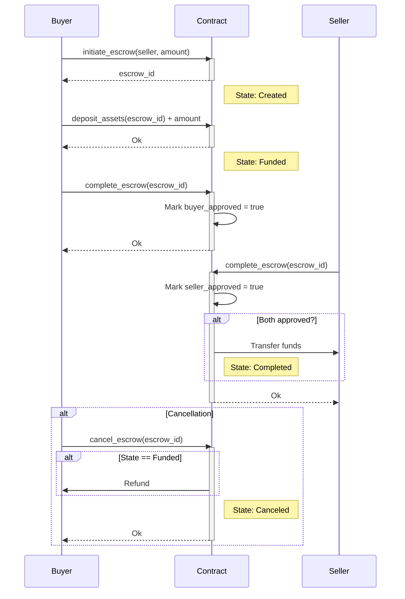

## Building an Escrow Contract (in Ink!)

Escrow is a financial arrangement where a neutral third party temporarily holds funds/assets while two parties complete a transaction. It ensures:  

1. **Security**: Funds are protected until conditions are met.  
2. **Trust**: Neither party can act unilaterally.  
3. **Automation**: Rules are enforced programmatically (via smart contracts).  

### Key Features

| Feature                 | Description                                            |  
|-------------------------|--------------------------------------------------------|  
| **Mutual Approval**     | Both buyer and seller must approve to release funds.   |  
| **Automatic Execution** | Transfers funds instantly when both parties approve.   |  
| **Cancellation**        | Allows refunds (when funded) if the transaction fails. |  
| **Transparency**        | All actions logged as on-chain events                  |  
| **Security Checks**     | Prevents invalid states.                               |  

### Data Structure

| Component          | Type         | Description                                  |
|--------------------|--------------|----------------------------------------------|
| `buyer`            | AccountId    | Initiator/asset depositor                    |
| `seller`           | AccountId    | Recipient of assets                          |
| `amount`           | Balance      | Agreed transaction value                     |
| `buyer_approved`   | bool         | Buyer's confirmation flag                    |
| `seller_approved`  | bool         | Seller's confirmation flag                   |
| `state`            | EscrowState  | Current lifecycle stage (see state diagram)  |

## Functions overview

### `initiate_escrow` - Start Transaction

**Key Points**:

- Buyer initiates by specifying seller/amount
- Prevents self-dealing with `buyer == seller` check
- Auto-increments escrow IDs

### `deposit_assets` - Fund Escrow

**Key Points**:

- Only buyer can deposit
- Exact amount required
- Must be in `Created` state

### `complete_escrow` - Mutual Approval

**Key Points**:

- Buyer and seller must call separately
- Prevents duplicate approvals
- Funds transfer only after mutual consent

### `cancel_escrow` - Abort Transaction

**Key Points**:

- Either party can cancel
- Refund only if funds were deposited
- Completed escrows cannot be canceled

### States



## Sequence Diagram



### Full Implementation

_lib.rs_

```rust
#![cfg_attr(not(feature = "std"), no_std, no_main)]

#[ink::contract]
mod escrow_smart_contract {
    use ink::storage::Mapping;

    /// Unique identifier for escrow transactions
    type EscrowId = u64;

    /// Represents the possible states of an escrow transaction.
    #[derive(Debug, PartialEq, Eq, scale::Encode, scale::Decode)]
    #[cfg_attr(feature = "std", derive(scale_info::TypeInfo, ink::storage::traits::StorageLayout))]
    pub enum EscrowState {
        /// The escrow has been created but no funds have been deposited.
        Created = 0,
        /// The buyer has deposited the agreed amount into the escrow.
        Funded = 1,
        /// Both parties have approved the transaction, and the funds have been transferred to the seller.
        Completed = 2,
        /// The escrow has been canceled, and the funds (if any) have been returned to the buyer.
        Canceled = 3,
    }

    /// Represents the possible errors that can occur during escrow operations.
    #[derive(Debug, PartialEq, Eq, scale::Encode, scale::Decode)]
    #[cfg_attr(feature = "std", derive(scale_info::TypeInfo))]
    pub enum Error {
        /// The caller is not authorized to perform the requested action.
        Unauthorized = 0,
        /// The escrow is in an invalid state for the requested operation.
        InvalidState = 1,
        /// The deposited amount is not equal to the agreed amount.
        InvalidAmount = 2,
        /// The party has already approved the transaction.
        AlreadyApproved = 3,
        /// The buyer and seller are the same account.
        InvalidParticipants = 4,
        /// The transfer of funds failed.
        TransferFailed = 5,
        /// The escrow with the given ID was not found.
        NotFound = 6,
        /// The escrow ID counter overflowed.
        IdOverflow = 7,
    }

    /// The main contract struct that holds the escrow data.
    #[ink(storage)]
    pub struct EscrowSmartContract {
        /// A mapping of escrow IDs to their corresponding escrow data.
        escrows: Mapping<EscrowId, Escrow>,
        /// The next available escrow ID.
        next_id: EscrowId,
    }

    //----------------------------------
    // Default Implementation
    //----------------------------------
    /// Provides default initialization values for the contract
    impl Default for EscrowSmartContract {
        fn default() -> Self {
            Self {
                next_id: 0,
                escrows: Mapping::new(),
            }
        }
    }

    /// Represents the data of an escrow transaction.
    #[derive(Debug, PartialEq, Eq, scale::Encode, scale::Decode)]
    #[cfg_attr(feature = "std", derive(scale_info::TypeInfo, ink::storage::traits::StorageLayout))]
    pub struct Escrow {
        /// The account ID of the buyer.
        buyer: AccountId,
        /// The account ID of the seller.
        seller: AccountId,
        /// The agreed amount to be transferred.
        amount: Balance,
        /// Whether the buyer has approved the transaction.
        buyer_approved: bool,
        /// Whether the seller has approved the transaction.
        seller_approved: bool,
        /// The current state of the escrow.
        state: EscrowState,
    }

    /// Event emitted when a new escrow is initiated.
    #[ink(event)]
    pub struct Initiated {
        /// The ID of the newly created escrow.
        #[ink(topic)]
        escrow_id: EscrowId,
        /// The buyer's account ID.
        buyer: AccountId,
        /// The seller's account ID.
        seller: AccountId,
        /// The agreed amount.
        amount: Balance,
    }

    /// Event emitted when funds are deposited into an escrow.
    #[ink(event)]
    pub struct Deposited {
        /// The ID of the escrow.
        #[ink(topic)]
        escrow_id: EscrowId,
        /// The deposited amount.
        amount: Balance,
    }

    /// Event emitted when an escrow is completed.
    #[ink(event)]
    pub struct Completed {
        /// The ID of the completed escrow.
        #[ink(topic)]
        escrow_id: EscrowId,
    }

    /// Event emitted when an escrow is canceled.
    #[ink(event)]
    pub struct Canceled {
        /// The ID of the canceled escrow.
        #[ink(topic)]
        escrow_id: EscrowId,
    }

    impl EscrowSmartContract {
        /// Constructor that initializes a new escrow contract.
        #[ink(constructor)]
        pub fn new() -> Self {
            Self {
                escrows: Mapping::default(),
                next_id: 0,
            }
        }

        /// Initiates a new escrow transaction.
        ///
        /// # Arguments
        ///
        /// * `seller` - The account ID of the seller.
        /// * `amount` - The agreed amount to be transferred.
        ///
        /// # Returns
        ///
        /// * `Ok(EscrowId)` - The ID of the newly created escrow.
        /// * `Err(Error)` - An error if the operation failed.
        #[ink(message)]
        pub fn initiate_escrow(
            &mut self,
            seller: AccountId,
            amount: Balance
        ) -> Result<EscrowId, Error> {
            // Get the caller's account ID (the buyer).
            let buyer = self.env().caller();
            // Check if the buyer and seller are the same account.
            if buyer == seller {
                return Err(Error::InvalidParticipants);
            }

            // Get the next available escrow ID.
            let escrow_id = self.next_id;
            // Increment the next ID, handling potential overflow.
            self.next_id = escrow_id.checked_add(1).ok_or(Error::IdOverflow)?;

            // Create the new escrow data.
            let escrow = Escrow {
                buyer,
                seller,
                amount,
                buyer_approved: false,
                seller_approved: false,
                state: EscrowState::Created,
            };

            // Insert the escrow data into the storage mapping.
            self.escrows.insert(escrow_id, &escrow);

            // Emit an event to notify about the new escrow.
            self.env().emit_event(Initiated {
                escrow_id,
                buyer,
                seller,
                amount,
            });

            // Return the new escrow ID.
            Ok(escrow_id)
        }

        /// Deposits funds into an escrow.
        ///
        /// # Arguments
        ///
        /// * `escrow_id` - The ID of the escrow.
        ///
        /// # Returns
        ///
        /// * `Ok(())` - If the deposit was successful.
        /// * `Err(Error)` - An error if the operation failed.
        #[ink(message, payable)]
        pub fn deposit_assets(&mut self, escrow_id: EscrowId) -> Result<(), Error> {
            // Get a mutable reference to the escrow data.
            let mut escrow = self.escrows.get(escrow_id).ok_or(Error::NotFound)?;
            // Get the caller's account ID.
            let caller = self.env().caller();

            // Check if the caller is the buyer.
            if caller != escrow.buyer {
                return Err(Error::Unauthorized);
            }

            // Check if the escrow is in the correct state.
            if escrow.state != EscrowState::Created {
                return Err(Error::InvalidState);
            }

            // Check if the deposited amount is correct.
            if self.env().transferred_value() != escrow.amount {
                return Err(Error::InvalidAmount);
            }

            // Update the escrow state.
            escrow.state = EscrowState::Funded;

            // Save changes back to storage
            self.escrows.insert(escrow_id, &escrow);

            // Emit an event to notify about the deposit.
            self.env().emit_event(Deposited {
                escrow_id,
                amount: escrow.amount,
            });

            Ok(())
        }

        /// Completes an escrow transaction if both parties have approved.
        ///
        /// # Arguments
        ///
        /// * `escrow_id` - The ID of the escrow.
        ///
        /// # Returns
        ///
        /// * `Ok(())` - If the escrow was successfully completed.
        /// * `Err(Error)` - An error if the operation failed.
        #[ink(message)]
        pub fn complete_escrow(&mut self, escrow_id: EscrowId) -> Result<(), Error> {
            // Get owned Escrow value
            let mut escrow = self.escrows.get(escrow_id).ok_or(Error::NotFound)?;

            // Check if the escrow is in the correct state.
            if escrow.state != EscrowState::Funded {
                return Err(Error::InvalidState);
            }

            // Pass owned value to approve function and get updated escrow
            escrow = self.approve(escrow, self.env().caller())?;

            // Save changes back to storage
            self.escrows.insert(escrow_id, &escrow);

            // Check if both parties have approved.
            if escrow.buyer_approved && escrow.seller_approved {
                // Transfer the funds to the seller.
                self
                    .env()
                    .transfer(escrow.seller, escrow.amount)
                    .map_err(|_| Error::TransferFailed)?;

                // Update the escrow state.
                escrow.state = EscrowState::Completed;

                // Save changes back to storage
                self.escrows.insert(escrow_id, &escrow);

                // Emit an event to notify about the completion.
                self.env().emit_event(Completed { escrow_id });
            }

            Ok(())
        }

        /// Cancels an escrow transaction and refunds the buyer if funded.
        ///
        /// # Arguments
        ///
        /// * `escrow_id` - The ID of the escrow.
        ///
        /// # Returns
        ///
        /// * `Ok(())` - If the escrow was successfully canceled.
        /// * `Err(Error)` - An error if the operation failed.
        #[ink(message)]
        pub fn cancel_escrow(&mut self, escrow_id: EscrowId) -> Result<(), Error> {
            // Get a mutable reference to the escrow data.
            let mut escrow = self.escrows.get(escrow_id).ok_or(Error::NotFound)?;
            // Get the caller's account ID.
            let caller = self.env().caller();

            // Check if the caller is the buyer or the seller.
            if caller != escrow.buyer && caller != escrow.seller {
                return Err(Error::Unauthorized);
            }

            // Check if the escrow is already completed.
            if escrow.state == EscrowState::Completed {
                return Err(Error::InvalidState);
            }

            // Refund buyer if escrow was funded
            if escrow.state == EscrowState::Funded {
                self
                    .env()
                    .transfer(escrow.buyer, escrow.amount)
                    .map_err(|_| Error::TransferFailed)?;
            }

            // Update the escrow state.
            escrow.state = EscrowState::Canceled;

            // Save the modified escrow back to storage
            self.escrows.insert(escrow_id, &escrow);

            // Emit an event to notify about the cancellation.
            self.env().emit_event(Canceled { escrow_id });

            Ok(())
        }

        // --- Helper functions ---

        /// Approves an escrow transaction for a given party.
        ///
        /// # Arguments
        ///
        /// * `escrow` - A mutable reference to the escrow data.
        /// * `caller` - The account ID of the party approving.
        ///
        /// # Returns
        ///
        /// * `Ok(())` - If the approval was successful.
        /// * `Err(Error)` - An error if the operation failed.
        fn approve(&mut self, mut escrow: Escrow, caller: AccountId) -> Result<Escrow, Error> {
            // Match the caller to the buyer or seller.
            match caller {
                // If the caller is the buyer.
                _ if caller == escrow.buyer => {
                    // Check if the buyer has already approved.
                    if escrow.buyer_approved {
                        return Err(Error::AlreadyApproved);
                    }
                    // Update the buyer's approval status.
                    escrow.buyer_approved = true;
                }
                // If the caller is the seller.
                _ if caller == escrow.seller => {
                    // Check if the seller has already approved.
                    if escrow.seller_approved {
                        return Err(Error::AlreadyApproved);
                    }
                    // Update the seller's approval status.
                    escrow.seller_approved = true;
                }
                // If the caller is neither the buyer nor the seller.
                _ => {
                    return Err(Error::Unauthorized);
                }
            }
            Ok(escrow)
        }

        #[ink(message)]
        pub fn get_escrow(&self, escrow_id: EscrowId) -> Option<Escrow> {
            self.escrows.get(escrow_id)
        }    
    }

    //----------------------------------
    // Tests here
    //----------------------------------

}

```


_Cargo.toml_

```toml
[package]
name = "escrow_smart_contract"
version = "0.1.0"
authors = ["[your_name] <[your_email]>"]
edition = "2021"

[dependencies]
ink = { version = "5.1.1", default-features = false }
scale = { package = "parity-scale-codec", version = "3.7.4", default-features = false, features = ["derive"] }
scale-info = { version = "2.11.6", default-features = false, features = ["derive"], optional = true }

[dev-dependencies]
ink_e2e = { version = "5.1.1" }

[lib]
path = "lib.rs"

[features]
default = ["std"]
std = [
    "ink/std",
    "scale/std",
    "scale-info/std",
]
ink-as-dependency = []
e2e-tests = []
```

### Test Scenarios

```rust
#[cfg(test)]
    mod tests {
        use super::*;

        #[ink::test]
        fn test_initiate_escrow() {
            let accounts = ink::env::test::default_accounts::<ink::env::DefaultEnvironment>();
            let mut contract = EscrowSmartContract::new();

            // Test successful initiation
            let amount = 100;
            let result = contract.initiate_escrow(accounts.bob, amount);
            assert!(result.is_ok());
            let escrow_id = result.unwrap();

            // Verify escrow details
            let escrow = contract.escrows.get(escrow_id).unwrap();
            assert_eq!(escrow.buyer, accounts.alice);
            assert_eq!(escrow.seller, accounts.bob);
            assert_eq!(escrow.amount, amount);
            assert_eq!(escrow.state, EscrowState::Created);

            // Test buyer cannot be seller
            let result = contract.initiate_escrow(accounts.alice, amount);
            assert_eq!(result, Err(Error::InvalidParticipants));
        }

        #[ink::test]
        fn test_deposit_assets() {
            let accounts = ink::env::test::default_accounts::<ink::env::DefaultEnvironment>();
            let mut contract = EscrowSmartContract::new();

            // Setup escrow
            let amount = 100;
            let escrow_id = contract.initiate_escrow(accounts.bob, amount).unwrap();

            // Test successful deposit
            ink::env::test::set_value_transferred::<ink::env::DefaultEnvironment>(amount);
            let result = contract.deposit_assets(escrow_id);
            assert!(result.is_ok());

            let escrow = contract.escrows.get(escrow_id).unwrap();
            assert_eq!(escrow.state, EscrowState::Funded);

            // Test wrong amount
            ink::env::test::set_value_transferred::<ink::env::DefaultEnvironment>(amount + 1);
            let result = contract.deposit_assets(escrow_id);
            assert_eq!(result, Err(Error::InvalidState));
        }

        #[ink::test]
        fn test_complete_escrow() {
            let accounts = ink::env::test::default_accounts::<ink::env::DefaultEnvironment>();
            let mut contract = EscrowSmartContract::new();

            // Setup funded escrow
            let amount = 100;
            // Set caller as buyer (alice) before initiating
            ink::env::test::set_caller::<ink::env::DefaultEnvironment>(accounts.alice);
            let escrow_id = contract.initiate_escrow(accounts.bob, amount).unwrap();

            // Deposit funds as buyer (still as alice)
            ink::env::test::set_value_transferred::<ink::env::DefaultEnvironment>(amount);
            contract.deposit_assets(escrow_id).unwrap();

            // Make sure we're still the buyer (alice) for approval
            ink::env::test::set_caller::<ink::env::DefaultEnvironment>(accounts.alice);
            let result = contract.complete_escrow(escrow_id);
            assert!(result.is_ok());

            let escrow = contract.escrows.get(escrow_id).unwrap();
            assert!(escrow.buyer_approved);
            assert!(!escrow.seller_approved);
            assert_eq!(escrow.state, EscrowState::Funded);

            // Test seller approval (bob)
            ink::env::test::set_caller::<ink::env::DefaultEnvironment>(accounts.bob);
            let result = contract.complete_escrow(escrow_id);
            assert!(result.is_ok());

            let escrow = contract.escrows.get(escrow_id).unwrap();
            assert!(escrow.buyer_approved);
            assert!(escrow.seller_approved);
            assert_eq!(escrow.state, EscrowState::Completed);
        }

        #[ink::test]
        fn test_cancel_escrow_by_buyer() {
            let accounts = ink::env::test::default_accounts::<ink::env::DefaultEnvironment>();
            let mut contract = EscrowSmartContract::new();

            // Setup funded escrow
            let amount = 100;
            let escrow_id = contract.initiate_escrow(accounts.bob, amount).unwrap();
            ink::env::test::set_value_transferred::<ink::env::DefaultEnvironment>(amount);
            contract.deposit_assets(escrow_id).unwrap();

            // Cancel by buyer
            let result = contract.cancel_escrow(escrow_id);
            assert!(result.is_ok());

            let escrow = contract.escrows.get(escrow_id).unwrap();
            assert_eq!(escrow.state, EscrowState::Canceled);
        }

        #[ink::test]
        fn test_cancel_escrow_completed() {
            let accounts = ink::env::test::default_accounts::<ink::env::DefaultEnvironment>();
            let mut contract = EscrowSmartContract::new();

            // Setup completed escrow
            let amount = 100;
            let escrow_id = contract.initiate_escrow(accounts.bob, amount).unwrap();
            ink::env::test::set_value_transferred::<ink::env::DefaultEnvironment>(amount);
            contract.deposit_assets(escrow_id).unwrap();

            // Buyer approves
            contract.complete_escrow(escrow_id).unwrap();

            // Seller approves
            ink::env::test::set_caller::<ink::env::DefaultEnvironment>(accounts.bob);
            contract.complete_escrow(escrow_id).unwrap();

            // Try to cancel a completed escrow
            ink::env::test::set_caller::<ink::env::DefaultEnvironment>(accounts.alice);
            let result = contract.cancel_escrow(escrow_id);
            assert_eq!(result, Err(Error::InvalidState));

            // Verify that the state is still completed
            let escrow = contract.escrows.get(escrow_id).unwrap();
            assert_eq!(escrow.state, EscrowState::Completed);
        }

        #[ink::test]
        fn test_unauthorized_actions() {
            let accounts = ink::env::test::default_accounts::<ink::env::DefaultEnvironment>();
            let mut contract = EscrowSmartContract::new();

            let amount = 100;
            let escrow_id = contract.initiate_escrow(accounts.bob, amount).unwrap();

            // Test unauthorized deposit
            ink::env::test::set_caller::<ink::env::DefaultEnvironment>(accounts.charlie);
            ink::env::test::set_value_transferred::<ink::env::DefaultEnvironment>(amount);
            let result = contract.deposit_assets(escrow_id);
            assert_eq!(result, Err(Error::Unauthorized));

            // Test unauthorized completion
            let result = contract.complete_escrow(escrow_id);
            assert_eq!(result, Err(Error::InvalidState));

            // Test unauthorized cancellation
            let result = contract.cancel_escrow(escrow_id);
            assert_eq!(result, Err(Error::Unauthorized));
        }
    }

```
