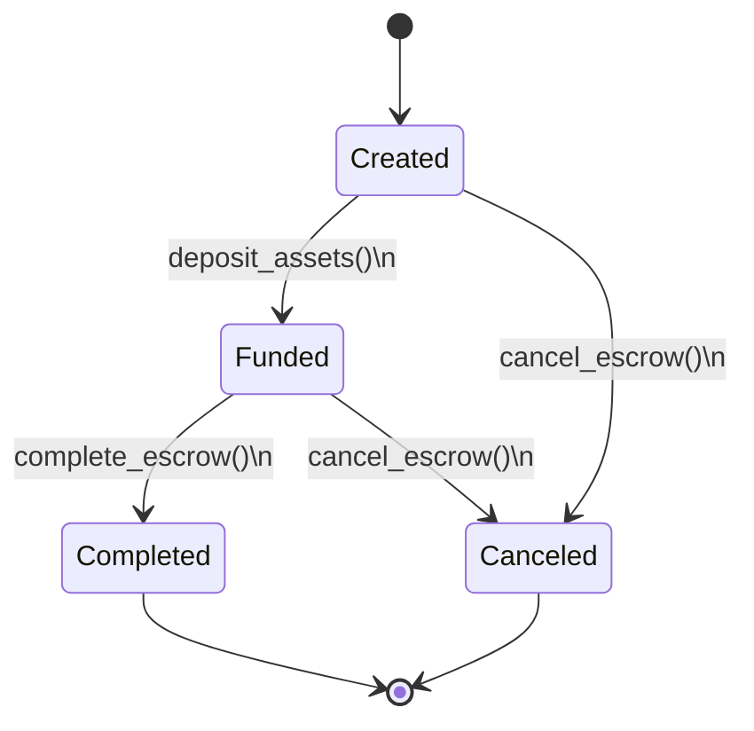
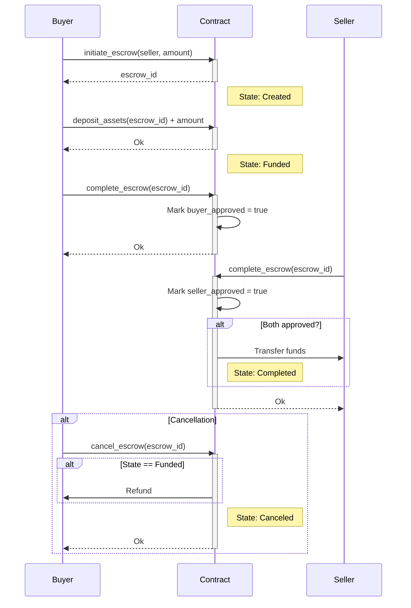

## Building an Escrow Contract (in Ink!)

Escrow is a financial arrangement where a neutral third party holds funds/assets temporarily while two parties complete a transaction. It ensures:  

1. **Security**: Funds are protected until conditions are met.  
2. **Trust**: Neither party can act unilaterally.  
3. **Automation**: Rules are enforced programmatically (via smart contracts).  

### Key Features

| Feature                 | Description                                            |  
|-------------------------|--------------------------------------------------------|  
| **Mutual Approval**     | Both buyer and seller must approve to release funds.   |  
| **Automatic Execution** | Transfers funds instantly when both parties approve.   |  
| **Cancellation**        | Allows refunds (when funded) if the transaction fails. |  
| **Transparency**        | All actions logged as on-chain events                  |  
| **Security Checks**     | Prevents invalid states.                               |  

### Data Structure

| Component          | Type         | Description                                  |
|---------------------|--------------|----------------------------------------------|
| `buyer`            | AccountId    | Initiator/asset depositor                    |
| `seller`           | AccountId    | Recipient of assets                          |
| `amount`           | Balance      | Agreed transaction value                     |
| `buyer_approved`   | bool         | Buyer's confirmation flag                    |
| `seller_approved`  | bool         | Seller's confirmation flag                   |
| `state`            | EscrowState  | Current lifecycle stage (see state diagram)   |

## Functions overview

### `initiate_escrow` - Start Transaction

**Key Points**:

- Buyer initiates by specifying seller/amount
- Prevents self-dealing with `buyer == seller` check
- Auto-increments escrow IDs

### `deposit_assets` - Fund Escrow

**Key Points**:

- Only buyer can deposit
- Exact amount required
- Must be in `Created` state

### `complete_escrow` - Mutual Approval

**Key Points**:

- Buyer and seller must call separately
- Prevents duplicate approvals
- Funds transfer only after mutual consent

### `cancel_escrow` - Abort Transaction

**Key Points**:

- Either party can cancel
- Refund only if funds were deposited
- Completed escrows cannot be canceled

### States

## Sequence Diagram

