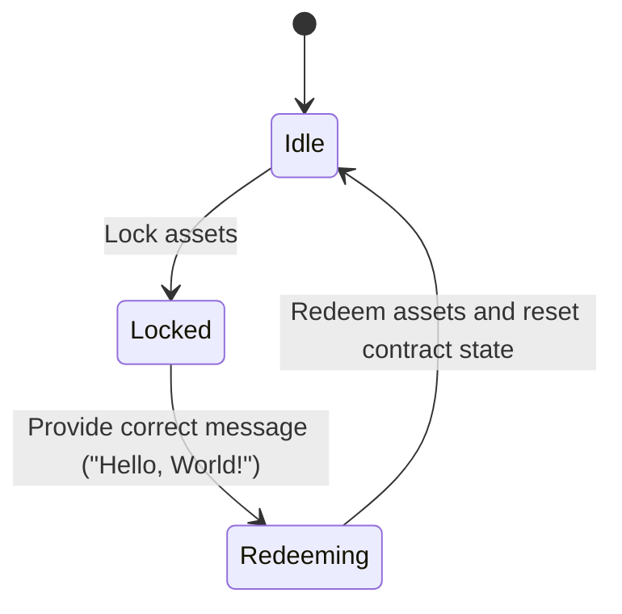
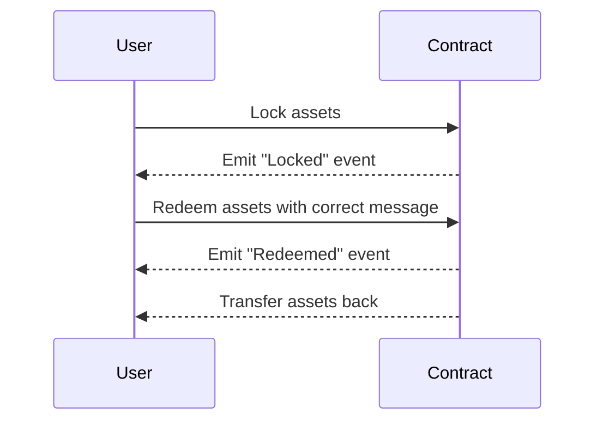

## Hello World (lock/unlock assets)

The Hello World smart contract is a simple lock-and-unlock assets contract.

### Key Features  

| Feature               | Description                                          |
|---------------------------|----------------------------------------------------------|
| Single Asset Locking      | - Only one account can lock assets at a time             |
|                           | - Requires non-zero token transfer during locking        |
| Message-Based Redemption  | - Requires exact match of "Hello, World!" message        |
|                           | - Only original locker can redeem                        |
| State Safety              | - Prevents double-locking                                |
|                           | - Resets state after redemption                          |

### Data Structure  

| Structure          | Type                 | Description                                         |
|--------------------|----------------------|-----------------------------------------------------|
| `locker`           | `Option<AccountId>`  | Stores address of current locker (`None` if empty)  |
| `locked_amount`    | `Balance`            | Amount of native tokens locked                      |
| **Error** enum     | Custom errors        | 5 variants covering all failure scenarios           |
| **Locked** event   | Event log            | Records locker address + amount on success          |
| **Redeemed** event | Event log            | Tracks redemption details                           |

### Functions Overview

#### `lock()` - Lock Asset

**Key Points**:

- Checks no existing lock
- Records sender's address  
- Stores sent token amount  
- Emits `Locked` event

#### `redeem()` - Redeem Asset

**Key Points**:  

- Identity check
- Message validation  
- Safe token transfer  
- State reset

### State Diagram

The state diagram shows the transitions between states based on user actions:



### Sequence Diagram

The sequence diagram illustrates the interactions between the user and the smart contract:



### Full Implementation

_lib.rs_

```rust
#![cfg_attr(not(feature = "std"), no_std, no_main)]

#[ink::contract]
mod lock_unlock_smart_contract {
    use ink::prelude::string::String;

    /// Represents the possible errors that can occur during escrow operations.
    #[derive(Debug, PartialEq, Eq, scale::Encode, scale::Decode)]
    #[cfg_attr(feature = "std", derive(scale_info::TypeInfo))]
    pub enum Error {
        AssetsAlreadyLocked = 0,
        NoAssetsSent = 1,
        NotLocker = 2,
        IncorrectMessage = 3,
        TransferFailed = 4,
    }

    /// This smart contract allows a user to lock assets and later redeem them by providing a specific message.
    ///
    /// **Functionality:**
    /// 1. **Locking:** A user can lock a certain amount of assets (native tokens) by calling the `lock` function.
    ///    - Only one user can lock assets at a time.
    ///    - The amount locked must be greater than zero.
    /// 2. **Redeeming:** The user who locked the assets can redeem them by calling the `redeem` function and providing the correct message ("Hello, World!").
    ///    - The contract will transfer the locked assets back to the locker.
    ///    - After redemption, the contract's state is reset, allowing another user to lock assets.
    ///
    /// **Events:**
    /// - `Locked`: Emitted when assets are successfully locked.
    /// - `Redeemed`: Emitted when assets are successfully redeemed.
    ///
    /// **Security Considerations:**
    /// - The contract ensures that only the locker can redeem the assets.
    /// - The contract verifies that the correct message is provided during redemption.
    /// - The contract prevents double-locking by checking if assets are already locked.
    #[ink(storage)]
    pub struct LockUnlockSmartContract {
        /// The account ID of the user who has locked the assets.
        /// `None` if no assets are currently locked.
        locker: Option<AccountId>,
        /// The amount of assets (in native tokens) that are currently locked.
        locked_amount: Balance,
    }

    /// Event emitted when assets are successfully locked.
    #[ink(event)]
    pub struct Locked {
        /// The account ID of the user who locked the assets.
        #[ink(topic)]
        locker: AccountId,
        /// The amount of assets that were locked.
        amount: Balance,
    }

    /// Event emitted when assets are successfully redeemed.
    #[ink(event)]
    pub struct Redeemed {
        /// The account ID of the user who redeemed the assets.
        #[ink(topic)]
        locker: AccountId,
        /// The amount of assets that were redeemed.
        amount: Balance,
    }

    //----------------------------------
    // Default Implementation
    //----------------------------------
    /// Provides default initialization values for the contract.
    ///
    /// When the contract is first deployed, it starts with no assets locked and no locker.
    impl Default for LockUnlockSmartContract {
        fn default() -> Self {
            Self {
                locker: None,
                locked_amount: 0,
            }
        }
    }

    impl LockUnlockSmartContract {
        /// Constructor that initializes the contract with default values.
        ///
        /// This function is called when the contract is deployed.
        #[ink(constructor)]
        pub fn new() -> Self {
            Self::default()
        }

        /// Locks the assets sent by the caller.
        ///
        /// **Requirements:**
        /// - No assets must be currently locked.
        /// - The caller must send a non-zero amount of assets.
        ///
        /// **Effects:**
        /// - Sets the `locker` to the caller's account ID.
        /// - Sets the `locked_amount` to the amount of assets sent.
        /// - Emits a `Locked` event.
        #[ink(message, payable)]
        pub fn lock(&mut self) -> Result<(), Error> {
            let caller = self.env().caller();
            let transferred = self.env().transferred_value();

            // Ensure no assets are already locked.
            if self.locker.is_some() {
                return Err(Error::AssetsAlreadyLocked);
            }

            // Ensure some assets are being sent to lock.
            if transferred == 0 {
                return Err(Error::NoAssetsSent);
            }

            // Set the locker and locked amount.
            self.locker = Some(caller);
            self.locked_amount = transferred;

            // Emit the Locked event.
            self.env().emit_event(Locked {
                locker: caller,
                amount: transferred,
            });

            Ok(())
        }

        /// Redeems the locked assets if the correct message is provided.
        ///
        /// **Requirements:**
        /// - The caller must be the same account that locked the assets.
        /// - The provided `message` must be "Hello, World!".
        ///
        /// **Effects:**
        /// - Transfers the `locked_amount` back to the `locker`.
        /// - Resets the `locker` to `None`.
        /// - Resets the `locked_amount` to 0.
        /// - Emits a `Redeemed` event.
        #[ink(message)]
        pub fn redeem(&mut self, message: String) -> Result<(), Error> {
            let caller = self.env().caller();

            // Ensure the caller is the locker.
            if self.locker != Some(caller) {
                return Err(Error::NotLocker);
            }

            // Verify the message matches the expected value.
            if message != "Hello, World!" {
                return Err(Error::IncorrectMessage);
            }

            // Transfer the locked assets back to the caller.
            let amount = self.locked_amount;
            self.env()
                .transfer(caller, amount)
                .map_err(|_| Error::TransferFailed)?;

            // Reset the contract state.
            self.locker = None;
            self.locked_amount = 0;

            // Emit the Redeemed event.
            self.env().emit_event(Redeemed {
                locker: caller,
                amount,
            });

            Ok(())
        }
    }

    //----------------------------------
    // Tests here
    //----------------------------------

}

```

_Cargo.toml_

```toml
[package]
name = "lock_unlock_smart_contract"
version = "0.1.0"
authors = ["[your_name] <[your_email]>"]
edition = "2021"

[dependencies]
ink = { version = "5.1.1", default-features = false }
scale = { package = "parity-scale-codec", version = "3.7.4", default-features = false, features = ["derive"] }
scale-info = { version = "2.11.6", default-features = false, features = ["derive"], optional = true }

[dev-dependencies]
ink_e2e = { version = "5.1.1" }

[lib]
path = "lib.rs"

[features]
default = ["std"]
std = [
    "ink/std",
    "scale/std",
    "scale-info/std",
]
ink-as-dependency = []
e2e-tests = []
```

### Test Scenarios

```rust
#[cfg(test)]
    mod tests {
        use super::*;
        use ink::env::test;

        #[ink::test]
        fn test_default_works() {
            let contract = LockUnlockSmartContract::default();
            assert_eq!(contract.locker, None);
            assert_eq!(contract.locked_amount, 0);
        }

        #[ink::test]
        fn test_new_works() {
            let contract = LockUnlockSmartContract::new();
            assert_eq!(contract.locker, None);
            assert_eq!(contract.locked_amount, 0);
        }

        #[ink::test]
        fn test_lock_works() {
            let mut contract = LockUnlockSmartContract::new();
            let accounts = test::default_accounts::<ink::env::DefaultEnvironment>();

            // Set the caller to Alice
            test::set_caller::<ink::env::DefaultEnvironment>(accounts.alice);
            // Set the transferred value to 100
            test::set_value_transferred::<ink::env::DefaultEnvironment>(100);

            assert!(contract.lock().is_ok());

            assert_eq!(contract.locker, Some(accounts.alice));
            assert_eq!(contract.locked_amount, 100);
        }

        #[ink::test]
        fn test_lock_fails_when_already_locked() {
            let mut contract = LockUnlockSmartContract::new();
            let accounts = test::default_accounts::<ink::env::DefaultEnvironment>();

            // Set the caller to Alice
            test::set_caller::<ink::env::DefaultEnvironment>(accounts.alice);
            // Set the transferred value to 100
            test::set_value_transferred::<ink::env::DefaultEnvironment>(100);

            assert!(contract.lock().is_ok());

            // Try to lock again
            let result = contract.lock();
            assert_eq!(result, Err(Error::AssetsAlreadyLocked));
        }

        #[ink::test]
        fn test_lock_fails_when_no_assets_sent() {
            let mut contract = LockUnlockSmartContract::new();
            let accounts = test::default_accounts::<ink::env::DefaultEnvironment>();

            // Set the caller to Alice
            test::set_caller::<ink::env::DefaultEnvironment>(accounts.alice);
            // Set the transferred value to 0
            test::set_value_transferred::<ink::env::DefaultEnvironment>(0);

            let result = contract.lock();
            assert_eq!(result, Err(Error::NoAssetsSent));
        }

        #[ink::test]
        fn test_redeem_works() {
            let mut contract = LockUnlockSmartContract::new();
            let accounts = test::default_accounts::<ink::env::DefaultEnvironment>();

            // Set the caller to Alice
            test::set_caller::<ink::env::DefaultEnvironment>(accounts.alice);
            // Set the transferred value to 100
            test::set_value_transferred::<ink::env::DefaultEnvironment>(100);

            assert!(contract.lock().is_ok());

            // Redeem the locked assets
            assert!(contract.redeem(String::from("Hello, World!")).is_ok());

            assert_eq!(contract.locker, None);
            assert_eq!(contract.locked_amount, 0);
        }

        #[ink::test]
        fn test_redeem_fails_when_not_locker() {
            let mut contract = LockUnlockSmartContract::new();
            let accounts = test::default_accounts::<ink::env::DefaultEnvironment>();

            // Set the caller to Alice
            test::set_caller::<ink::env::DefaultEnvironment>(accounts.alice);
            // Set the transferred value to 100
            test::set_value_transferred::<ink::env::DefaultEnvironment>(100);

            assert!(contract.lock().is_ok());

            // Set the caller to Bob
            test::set_caller::<ink::env::DefaultEnvironment>(accounts.bob);

            // Try to redeem the locked assets
            let result = contract.redeem(String::from("Hello, World!"));
            assert_eq!(result, Err(Error::NotLocker));
        }

        #[ink::test]
        fn test_redeem_fails_with_incorrect_message() {
            let mut contract = LockUnlockSmartContract::new();
            let accounts = test::default_accounts::<ink::env::DefaultEnvironment>();

            // Set the caller to Alice
            test::set_caller::<ink::env::DefaultEnvironment>(accounts.alice);
            // Set the transferred value to 100
            test::set_value_transferred::<ink::env::DefaultEnvironment>(100);

            assert!(contract.lock().is_ok());

            // Try to redeem with an incorrect message
            let result = contract.redeem(String::from("Wrong message"));
            assert_eq!(result, Err(Error::IncorrectMessage));
        }
    }
```