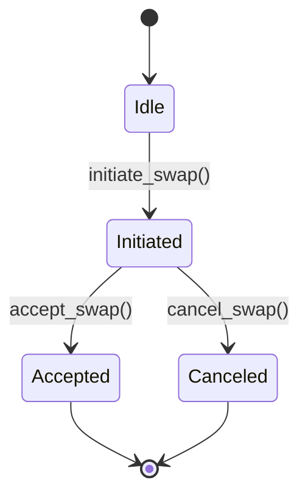
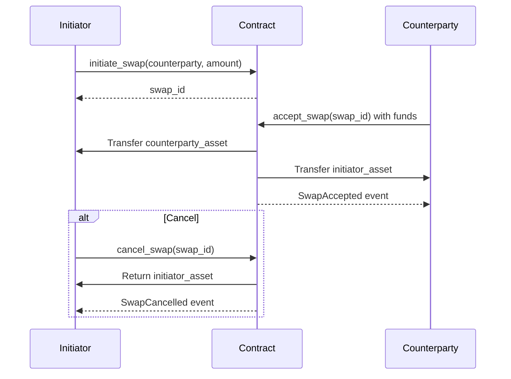

## Building a simple Asset Swap

This smart contract is designed to be used in a peer-to-peer exchange scenario where two parties agree to exchange assets. The contract ensures that the assets are locked up until it is accepted by the other party. At any point before it is accepted, one can cancel the swap to retrieve the assets.

This contract is just for academic purposes because of its limitations. It assumes that both parties are dealing with the same asset type. It lacks the ability to handle multiple asset types or interact with token standards (e.g., ERC-20 or PSP-22 for Polkadot).

### Key Features

| Feature | Description |
|---------|-------------|
| Atomic Swaps | Either both parties get their assets or the swap is canceled |
| Authorization Checks | Strict permission controls for swap operations |
| Reentrancy Protection | Prevents recursive call attacks |
| Event Logging | Track all swap lifecycle changes |
| Detailed Error Codes | Clear failure reasons for debugging |
| Storage Efficiency | Optimized mapping structure for swap storage |

### Data Structures

| Structure | Fields | Description |
|-----------|--------|-------------|
| `Swap` | initiator: AccountId<br>counterparty: AccountId<br>initiator_asset: Balance<br>counterparty_asset: Balance | Represents a single swap agreement |
| `SwapContract` | swaps: Mapping<u32, Swap><br>next_swap_id: u32<br>reentrancy_guard: bool | Main contract storage with security features |

### Functions Overview

#### `initiate_swap()` - Creates new swap agreement

- **Key Points:**
  - Validate initiator's deposit > 0
  - Generate incremental swap ID
  - Store terms in mapping
  - Emit SwapInitiated event

#### `accept_swap()` - Execute asset exchange

- **Key Points:**
  - Activate reentrancy guard
  - Verify counterparty identity
  - Validate transferred amount
  - Transfer assets atomically
  - Clean storage & emit event

#### `cancel_swap()` - Abort swap and refund

- **Key Points:**
  - Verify initiator identity
  - Return locked funds
  - Remove swap record
  - Emit cancellation event

### State Diagram



### Sequence Diagram




### Full Implementation

_lib.rs_

```rust
#![cfg_attr(not(feature = "std"), no_std, no_main)]

#[ink::contract]
mod swap_contract {
    use ink::storage::Mapping;

    /// Represents a swap agreement between two parties
    /// # Fields
    /// - initiator: Account that created the swap
    /// - counterparty: Account that can accept the swap
    /// - initiator_asset: Amount of native token deposited by initiator
    /// - counterparty_asset: Required amount from counterparty to complete swap
    #[derive(scale::Decode, scale::Encode)]
    #[cfg_attr(
        feature = "std",
        derive(scale_info::TypeInfo, ink::storage::traits::StorageLayout)
    )]
    pub struct Swap {
        initiator: AccountId,
        counterparty: AccountId,
        initiator_asset: Balance,
        counterparty_asset: Balance,
    }

    /// Main contract storage structure
    #[ink(storage)]
    pub struct SwapContract {
        /// Stores all active swaps by ID
        swaps: Mapping<u32, Swap>,
        /// Auto-incrementing ID counter for new swaps
        next_swap_id: u32,
        reentrancy_guard: bool, // Add this line
    }

    /// Custom error types for swap operations
    #[derive(Debug, PartialEq, Eq, scale::Encode, scale::Decode)]
    #[cfg_attr(feature = "std", derive(scale_info::TypeInfo))]
    pub enum Error {
        /// Requested swap ID does not exist
        SwapNotFound = 0,
        /// Caller is not authorized for this operation
        NotAuthorized = 1,
        /// Initiator's deposit is zero or insufficient
        InsufficientInitiatorBalance = 2,
        /// Counterparty's deposit is insufficient
        InsufficientCounterpartyBalance = 3,
        /// Swap ID overflow occurred
        SwapIdOverflow = 4,
        /// Reentrancy detected
        Reentrancy = 5,
    }

    /// Emitted when a new swap is created
    #[ink(event)]
    pub struct SwapInitiated {
        #[ink(topic)]
        swap_id: u32,
        initiator: AccountId,
        counterparty: AccountId,
        initiator_asset: Balance,
        counterparty_asset: Balance,
    }

    /// Emitted when a swap is successfully completed
    #[ink(event)]
    pub struct SwapAccepted {
        #[ink(topic)]
        swap_id: u32,
    }

    /// Emitted when a swap is canceled by initiator
    #[ink(event)]
    pub struct SwapCancelled {
        #[ink(topic)]
        swap_id: u32,
    }

    //----------------------------------
    // Default Implementation
    //----------------------------------
    /// Provides default initialization values for the contract.
    ///
    /// When the contract is first deployed, it starts with no assets locked and no locker.
    impl Default for SwapContract {
        fn default() -> Self {
            Self {
                swaps: Mapping::default(),
                next_swap_id: 0,
                reentrancy_guard: false,
            }
        }
    }

    impl SwapContract {
        /// Creates a new swap contract with empty state
        #[ink(constructor)]
        pub fn new() -> Self {
            Self::default()
        }

        /// Transfers funds to the specified account
        /// # Arguments
        /// - `to`: The account to transfer funds to
        /// - `amount`: The amount of funds to transfer
        /// # Returns
        /// - `Ok(())`: If the transfer was successful
        /// - `Err(Error::InsufficientBalance)`: If the transfer failed due to insufficient balance
        fn transfer_funds(&self, to: AccountId, amount: Balance) -> Result<(), Error> {
            self.env().transfer(to, amount).map_err(|_| Error::InsufficientCounterpartyBalance)
        }

        /// Emits an event indicating that a new swap has been initiated
        /// # Arguments
        /// - `swap_id`: The ID of the newly created swap
        /// - `initiator`: The account that initiated the swap
        /// - `counterparty`: The account that can accept the swap
        /// - `initiator_asset`: The amount of native token deposited by the initiator
        /// - `counterparty_asset`: The required amount from the counterparty to complete the swap
        fn emit_swap_initiated(&self, swap_id: u32, initiator: AccountId, counterparty: AccountId, initiator_asset: Balance, counterparty_asset: Balance) {
            self.env().emit_event(SwapInitiated {
                swap_id,
                initiator,
                counterparty,
                initiator_asset,
                counterparty_asset,
            });
        }

        /// Emits an event indicating that a swap has been accepted
        /// # Arguments
        /// - `swap_id`: The ID of the accepted swap
        fn emit_swap_accepted(&self, swap_id: u32) {
            self.env().emit_event(SwapAccepted { swap_id });
        }

        /// Emits an event indicating that a swap has been cancelled
        /// # Arguments
        /// - `swap_id`: The ID of the cancelled swap
        fn emit_swap_cancelled(&self, swap_id: u32) {
            self.env().emit_event(SwapCancelled { swap_id });
        }

        /// Creates a new swap agreement
        /// # Arguments
        /// - counterparty: Account that can accept the swap
        /// - counterparty_asset: Required deposit from counterparty
        /// # Returns
        /// - Ok(u32): Newly created swap ID
        /// - Err(Error): Failure reason
        /// # Note
        /// Caller must send native tokens equal to initiator_asset
        #[ink(message, payable)]
        pub fn initiate_swap(
            &mut self,
            counterparty: AccountId,
            counterparty_asset: Balance
        ) -> Result<u32, Error> {
            let initiator = self.env().caller();
            let initiator_asset = self.env().transferred_value();

            // Validate initiator's deposit
            if initiator_asset == 0 {
                return Err(Error::InsufficientInitiatorBalance);
            }

            let swap_id = self.next_swap_id;
            self.next_swap_id = swap_id.checked_add(1)
                .ok_or(Error::SwapIdOverflow)?;

            let swap = Swap {
                initiator,
                counterparty,
                initiator_asset,
                counterparty_asset,
            };

            self.swaps.insert(swap_id, &swap);

            self.emit_swap_initiated(swap_id, initiator, counterparty, initiator_asset, counterparty_asset);

            Ok(swap_id)
        }

        /// Completes an existing swap agreement
        /// # Arguments
        /// - swap_id: ID of swap to complete
        /// # Returns
        /// - Ok(()): Success
        /// - Err(Error): Failure reason
        /// # Note
        /// Caller must be counterparty and send required assets
        #[ink(message, payable)]
        pub fn accept_swap(&mut self, swap_id: u32) -> Result<(), Error> {
            self.enter_reentrancy_guard()?;
            let result = (|| {
                let swap = self.swaps.get(swap_id).ok_or(Error::SwapNotFound)?;
                let caller = self.env().caller();

                // Authorization check
                if caller != swap.counterparty {
                    return Err(Error::NotAuthorized);
                }

                // Validate counterparty's deposit
                let transferred = self.env().transferred_value();
                if transferred != swap.counterparty_asset {
                    return Err(Error::InsufficientCounterpartyBalance);
                }

                // Execute asset exchange
                self.transfer_funds(swap.initiator, transferred)?;
                self.transfer_funds(swap.counterparty, swap.initiator_asset)?;

                // Cleanup storage
                self.swaps.remove(swap_id);

                self.emit_swap_accepted(swap_id);

                Ok(())
            })();
            self.exit_reentrancy_guard();
            result
        }

        /// Cancels an existing swap agreement
        /// # Arguments
        /// - swap_id: ID of swap to cancel
        /// # Returns
        /// - Ok(()): Success
        /// - Err(Error): Failure reason
        #[ink(message)]
        pub fn cancel_swap(&mut self, swap_id: u32) -> Result<(), Error> {
            self.enter_reentrancy_guard()?;
            let result = (|| {
                let swap = self.swaps.get(swap_id).ok_or(Error::SwapNotFound)?;
                let caller = self.env().caller();

                // Authorization check
                if caller != swap.initiator {
                    return Err(Error::NotAuthorized);
                }

                // Return initiator's funds
                self.transfer_funds(swap.initiator, swap.initiator_asset)?;

                // Cleanup storage
                self.swaps.remove(swap_id);

                self.emit_swap_cancelled(swap_id);

                Ok(())
            })();
            self.exit_reentrancy_guard();
            result
        }

        fn enter_reentrancy_guard(&mut self) -> Result<(), Error> {
            if self.reentrancy_guard {
                return Err(Error::Reentrancy);
            }
            self.reentrancy_guard = true;
            Ok(())
        }

        fn exit_reentrancy_guard(&mut self) {
            self.reentrancy_guard = false;
        }
    }
    //----------------------------------
    // Tests here
    //----------------------------------
}

```

_Cargo.toml_

```toml
[package]
name = "swap_contract"
version = "0.1.0"
authors = ["[your_name] <[your_email]>"]
edition = "2021"

[dependencies]
ink = { version = "5.1.1", default-features = false }
scale = { package = "parity-scale-codec", version = "3.7.4", default-features = false, features = ["derive"] }
scale-info = { version = "2.11.6", default-features = false, features = ["derive"], optional = true }

[dev-dependencies]
ink_e2e = { version = "5.1.1" }

[lib]
path = "lib.rs"

[features]
default = ["std"]
std = [
    "ink/std",
    "scale/std",
    "scale-info/std",
]
ink-as-dependency = []
e2e-tests = []
```

### Test Scenarios

```rust
    #[cfg(test)]
    mod tests {
        use super::*;
        use ink::env::{test, DefaultEnvironment};

        /// # Swap Contract Test Suite
        ///
        /// This module contains comprehensive tests for the SwapContract,
        /// covering core functionality, edge cases, and security requirements.
        ///
        /// ## Test Accounts Convention:
        /// - Alice: Default caller/initiator (ink! default account)
        /// - Bob: Counterparty account
        /// - Charlie: Unauthorized third party
        
        /// Helper function to get test accounts
        fn get_accounts() -> test::DefaultAccounts<DefaultEnvironment> {
            test::default_accounts()
        }

        #[ink::test]
        fn initiate_swap_works() {
            let mut contract = SwapContract::new();
            let accounts = get_accounts();

            // Alice initiates swap
            test::set_caller::<DefaultEnvironment>(accounts.alice);
            test::set_value_transferred::<DefaultEnvironment>(100);
            
            let result = contract.initiate_swap(accounts.bob, 200);
            assert!(result.is_ok());
            
            let swap_id = result.unwrap();
            let swap = contract.swaps.get(swap_id).unwrap();
            
            assert_eq!(swap.initiator, accounts.alice);
            assert_eq!(swap.counterparty, accounts.bob);
            assert_eq!(swap.initiator_asset, 100);
            assert_eq!(swap.counterparty_asset, 200);
        }

        #[ink::test]
        fn accept_swap_success() {
            let mut contract = SwapContract::new();
            let accounts = get_accounts();

            // Setup swap
            test::set_caller::<DefaultEnvironment>(accounts.alice);
            test::set_value_transferred::<DefaultEnvironment>(100);
            let swap_id = contract.initiate_swap(accounts.bob, 200).unwrap();

            // Bob accepts swap
            test::set_caller::<DefaultEnvironment>(accounts.bob);
            test::set_value_transferred::<DefaultEnvironment>(200);
            
            assert!(contract.accept_swap(swap_id).is_ok());
            assert!(contract.swaps.get(swap_id).is_none());
        }

        #[ink::test]
        fn cancel_swap_success() {
            let mut contract = SwapContract::new();
            let accounts = get_accounts();

            // Setup swap
            test::set_caller::<DefaultEnvironment>(accounts.alice);
            test::set_value_transferred::<DefaultEnvironment>(100);
            let swap_id = contract.initiate_swap(accounts.bob, 200).unwrap();

            // Alice cancels swap
            assert!(contract.cancel_swap(swap_id).is_ok());
            assert!(contract.swaps.get(swap_id).is_none());
        }

        #[ink::test]
        fn accept_swap_fails_wrong_counterparty() {
            let mut contract = SwapContract::new();
            let accounts = get_accounts();

            test::set_caller::<DefaultEnvironment>(accounts.alice);
            test::set_value_transferred::<DefaultEnvironment>(100);
            let swap_id = contract.initiate_swap(accounts.bob, 200).unwrap();

            // Charlie tries to accept
            test::set_caller::<DefaultEnvironment>(accounts.charlie);
            test::set_value_transferred::<DefaultEnvironment>(200);
            
            assert_eq!(contract.accept_swap(swap_id), Err(Error::NotAuthorized));
        }

        #[ink::test]
        fn cancel_swap_fails_non_initiator() {
            let mut contract = SwapContract::new();
            let accounts = get_accounts();

            test::set_caller::<DefaultEnvironment>(accounts.alice);
            test::set_value_transferred::<DefaultEnvironment>(100);
            let swap_id = contract.initiate_swap(accounts.bob, 200).unwrap();

            // Bob tries to cancel
            test::set_caller::<DefaultEnvironment>(accounts.bob);
            assert_eq!(contract.cancel_swap(swap_id), Err(Error::NotAuthorized));
        }

        #[ink::test]
        fn accept_swap_fails_insufficient_deposit() {
            let mut contract = SwapContract::new();
            let accounts = get_accounts();

            test::set_caller::<DefaultEnvironment>(accounts.alice);
            test::set_value_transferred::<DefaultEnvironment>(100);
            let swap_id = contract.initiate_swap(accounts.bob, 200).unwrap();

            // Bob sends wrong amount
            test::set_caller::<DefaultEnvironment>(accounts.bob);
            test::set_value_transferred::<DefaultEnvironment>(150);
            
            assert_eq!(contract.accept_swap(swap_id), Err(Error::InsufficientCounterpartyBalance));
        }

        #[ink::test]
        fn initiate_swap_fails_zero_deposit() {
            let mut contract = SwapContract::new();
            let accounts = get_accounts();

            test::set_caller::<DefaultEnvironment>(accounts.alice);
            test::set_value_transferred::<DefaultEnvironment>(0);
            
            assert_eq!(
                contract.initiate_swap(accounts.bob, 200),
                Err(Error::InsufficientInitiatorBalance)
            );
        }

        #[ink::test]
        fn double_accept_swap_fails() {
            let mut contract = SwapContract::new();
            let accounts = get_accounts();

            // Setup and accept swap
            test::set_caller::<DefaultEnvironment>(accounts.alice);
            test::set_value_transferred::<DefaultEnvironment>(100);
            let swap_id = contract.initiate_swap(accounts.bob, 200).unwrap();

            test::set_caller::<DefaultEnvironment>(accounts.bob);
            test::set_value_transferred::<DefaultEnvironment>(200);
            contract.accept_swap(swap_id).unwrap();

            // Try to accept again
            assert_eq!(contract.accept_swap(swap_id), Err(Error::SwapNotFound));
        }
    }
```
