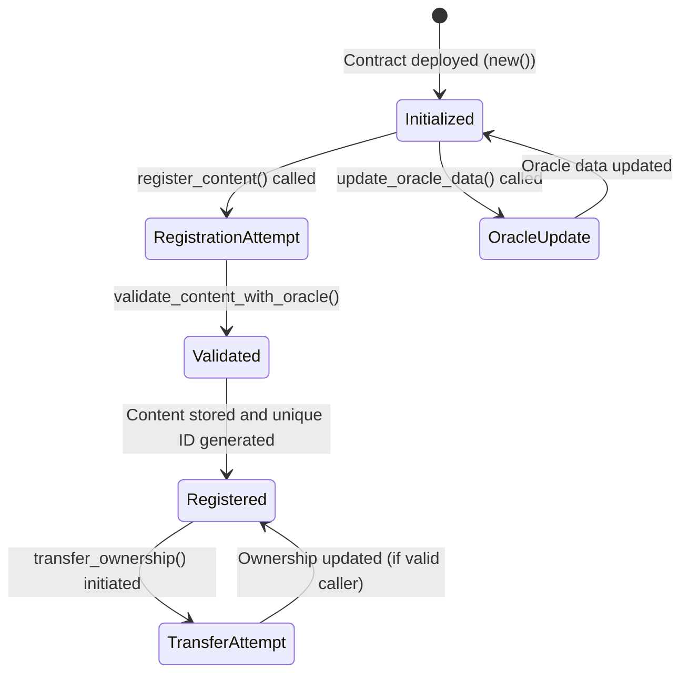
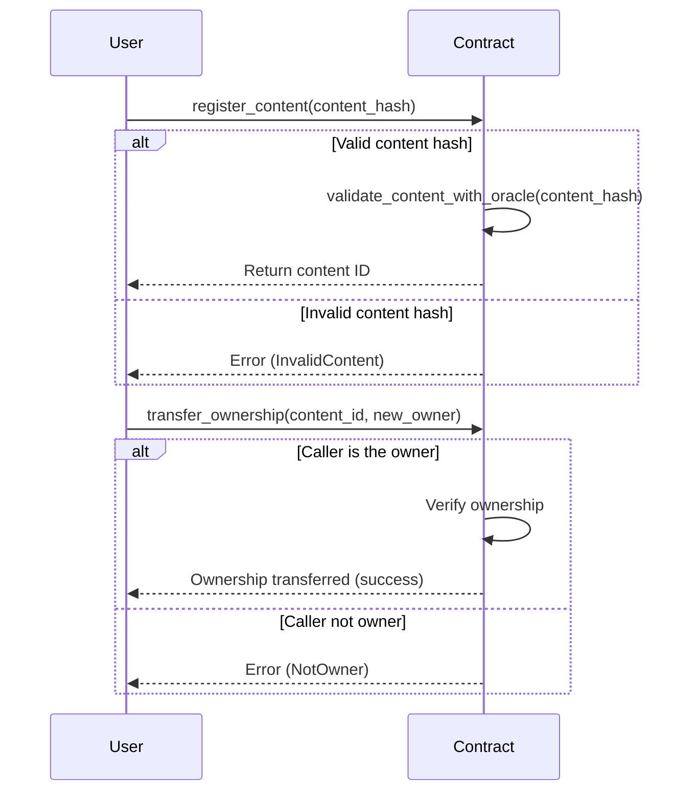

## Building a simple Content Ownership contract

This contract allows you to create a content registry, and users can create content to be stored in the registry.

It facilitates the on-chain record of content (i.e., files on IPFS) ownership and transfer. While one cannot prevent others from obtaining a copy of the content, the app owner of the contract can serve as the single source of truth of who owns the content. With the blockchain trace and record in place, it provides a trustless way to verify the ownership of the content and facilitates further application logic such as royalties, licensing, etc.

### Key Features

| Feature                          | Description                                                                 |
|----------------------------------|-----------------------------------------------------------------------------|
| **Admin Control**                | The deployer of the contract is the admin and can update oracle data        |
| **Content Registration**         | Users can register digital content with a unique identifier (e.g. IPFS hash)|
| **Ownership Transfer**           | Ownership of registered content can be transferred securely                 |
| **Oracle Validation**            | Content hashes are validated against oracle data for integrity              |
| **Content Retrieval**            | Retrieve content details by its unique identifier                           |

### Data Structures

| Component            | Type                          | Description                                                             |
|-----------------------|-------------------------------|------------------------------------------------------------------------|
| **Content**           | `struct`                     | Represents a digital content record                                     |
| **Error**             | `enum`                       | Custom error types for contract operations                              |
| **ContentOwnership**  | `struct`                     | The main storage structure of the contract                              |

### Functions Overview

#### `new()` - Initializes the Contract

- **Key Points:**
- Sets the deployer as admin  
- Uses default values

#### `update_oracle_data(new_data: String)` - Updates Oracle Data

- **Key Points:**
- Only the **admin** can update  
- Stores the new oracle reference

#### `register_content(content_hash: String)` - Registers New Content

- **Key Points:**  
- Validates the content hash against the oracle data  
- Checks for duplicate content  
- Generates a unique ID and stores the content record

#### `transfer_ownership(content_id: u64, new_owner: AccountId)` - Transfers Ownership

- **Key Points:**  
- Verifies the caller is the current owner  
- Updates the record with the new owner

#### `get_content(content_id: u64)` - Retrieves Content Record

- **Key Points:**
- Returns the content record if found

#### `get_oracle_data()` - Retrieves Current Oracle Data

- **Key Points:**  
- Returns the stored oracle data

### State Diagram



### Sequence Diagram



### Full Implementation

_lib.rs_

```rust

#![cfg_attr(not(feature = "std"), no_std, no_main)]

/// The `content_ownership` module defines a smart contract for managing digital content ownership.
/// It allows users to register digital content, transfer ownership, and validate content using oracle data.
#[ink::contract]
mod content_ownership {
    use ink::storage::Mapping;
    use ink::prelude::string::String;
    use ink::prelude::collections::BTreeMap;

    /// Represents a digital content record stored on-chain.
    /// Each record contains:
    /// - `content_hash`: A unique identifier for the content (e.g., an IPFS hash).
    /// - `owner`: The AccountId of the current owner of the content.
    #[derive(scale::Encode, scale::Decode, Clone, Debug, PartialEq, Eq)]
    #[cfg_attr(feature = "std", derive(scale_info::TypeInfo, ink::storage::traits::StorageLayout))]
    pub struct Content {
        content_hash: String,
        owner: AccountId,
    }

    /// Defines custom error types for the contract.
    /// These errors are returned when specific conditions are not met.
    #[derive(Debug, PartialEq, Eq, scale::Encode, scale::Decode)]
    #[cfg_attr(feature = "std", derive(scale_info::TypeInfo))]
    pub enum Error {
        /// Error returned when a non-admin user attempts an admin-only action.
        NotAdmin = 0,
        /// Error returned when a content ID is not found in the storage.
        ContentNotFound = 1,
        /// Error returned when a non-owner attempts to transfer ownership.
        NotOwner = 2,
        /// Error returned when the content ID counter overflows.
        CounterOverflow = 3,
        /// Error returned when the content hash is deemed invalid by the oracle.
        InvalidContent = 4,
    }

    /// A type alias for the contract's result type.
    /// It wraps the `Result` type with the contract's custom `Error` enum.
    pub type Result<T> = core::result::Result<T, Error>;

    /// The `ContentOwnership` contract manages digital content and its ownership.
    /// It provides functionality for:
    /// - Registering new content.
    /// - Transferring ownership of content.
    /// - Validating content using oracle data.
    #[ink(storage)]
    pub struct ContentOwnership {
        /// The administrator of the contract, typically the deployer.
        admin: AccountId,
        /// Oracle data used for validating content (e.g., a hash of licensing terms).
        oracle_data: String,
        /// A mapping of content IDs to their corresponding content records.
        contents: Mapping<u64, Content>,
        /// A counter for generating unique content IDs.
        next_content_id: u64,
        /// A mapping of content hashes to their corresponding content IDs.
        content_hash_to_id: BTreeMap<String, u64>,
    }

    //----------------------------------
    // Default Implementation
    //----------------------------------

    /// Provides default initialization values for the contract.
    /// This is primarily used for testing or demonstration purposes.
    impl Default for ContentOwnership {
        fn default() -> Self {
            Self {
                admin: AccountId::from([0u8; 32]),
                oracle_data: String::from("default_oracle"),
                contents: Mapping::default(),
                next_content_id: 1,
                content_hash_to_id: BTreeMap::new(),
            }
        }
    }

    //----------------------------------
    // Contract Implementation
    //----------------------------------

    impl ContentOwnership {
        /// Constructor: Initializes the contract with the deployer as the admin and sets the initial oracle data.
        #[ink(constructor)]
        pub fn new() -> Self {
            Self {
                admin: Self::env().caller(),
                ..Default::default()
            }
        }

        /// Updates the oracle data stored in the contract.
        /// Only the admin can call this function.
        ///
        /// # Arguments
        /// - `new_data`: The new oracle data to be stored.
        ///
        /// # Errors
        /// - Returns `Error::NotAdmin` if the caller is not the admin.
        #[ink(message)]
        pub fn update_oracle_data(&mut self, new_data: String) -> Result<()> {
            if self.env().caller() != self.admin {
                return Err(Error::NotAdmin);
            }
            self.oracle_data = new_data;
            Ok(())
        }

        /// Registers new digital content on-chain.
        /// The caller provides a content hash, which is validated against the oracle data.
        /// If valid, the content is stored with the caller as the owner.
        ///
        /// # Arguments
        /// - `content_hash`: The unique hash representing the content (e.g., an IPFS hash).
        ///
        /// # Returns
        /// - A unique content ID for the registered content.
        ///
        /// # Errors
        /// - Returns `Error::InvalidContent` if the content hash is invalid.
        /// - Returns `Error::CounterOverflow` if the content ID counter overflows.
        #[ink(message)]
        pub fn register_content(&mut self, content_hash: String) -> Result<u64> {
            if !self.validate_content_with_oracle(&content_hash) {
                return Err(Error::InvalidContent);
            }

            if self.content_hash_to_id.contains_key(&content_hash) {
                return Ok(*self.content_hash_to_id.get(&content_hash).unwrap());
            }
            let caller = self.env().caller();
            let content_id = self.next_content_id;
            self.next_content_id = self.next_content_id
                .checked_add(1)
                .ok_or(Error::CounterOverflow)?;
            let record = Content {
                content_hash: content_hash.clone(),
                owner: caller,
            };
            self.contents.insert(content_id, &record);
            self.content_hash_to_id.insert(content_hash, content_id);
            Ok(content_id)
        }

        /// Validates a content hash against the oracle data.
        ///
        /// # Arguments
        /// - `content_hash`: The hash to validate.
        ///
        /// # Returns
        /// - `true` if the content hash is valid, `false` otherwise.
        fn validate_content_with_oracle(&self, content_hash: &str) -> bool {
            content_hash.starts_with(&self.oracle_data)
        }

        /// Transfers ownership of a registered content item to a new owner.
        /// Only the current owner can authorize the transfer.
        ///
        /// # Arguments
        /// - `content_id`: The unique ID of the content to transfer.
        /// - `new_owner`: The AccountId of the new owner.
        ///
        /// # Errors
        /// - Returns `Error::ContentNotFound` if the content ID is not found.
        /// - Returns `Error::NotOwner` if the caller is not the current owner.
        #[ink(message)]
        pub fn transfer_ownership(&mut self, content_id: u64, new_owner: AccountId) -> Result<()> {
            let mut record = self.contents.get(content_id).ok_or(Error::ContentNotFound)?;
            if self.env().caller() != record.owner {
                return Err(Error::NotOwner);
            }
            record.owner = new_owner;
            self.contents.insert(content_id, &record);
            Ok(())
        }

        /// Retrieves a content record by its unique identifier.
        ///
        /// # Arguments
        /// - `content_id`: The unique ID of the content to retrieve.
        ///
        /// # Returns
        /// - An `Option` containing the content record if found, or `None` if not found.
        #[ink(message)]
        pub fn get_content(&self, content_id: u64) -> Option<Content> {
            self.contents.get(content_id)
        }

        /// Returns the current oracle data stored in the contract.
        ///
        /// # Returns
        /// - A `String` containing the oracle data.
        #[ink(message)]
        pub fn get_oracle_data(&self) -> String {
            self.oracle_data.clone()
        }
    }

    //----------------------------------
    // Unit Tests here
    //----------------------------------

}

```

_Cargo.toml_

```toml
[package]
name = "content_ownership"
version = "0.1.0"
authors = ["[your_name] <[your_email]>"]
edition = "2021"

[dependencies]
ink = { version = "5.1.1", default-features = false }
scale = { package = "parity-scale-codec", version = "3.7.4", default-features = false, features = ["derive"] }
scale-info = { version = "2.11.6", default-features = false, features = ["derive"], optional = true }

[dev-dependencies]
ink_e2e = { version = "5.1.1" }

[lib]
path = "lib.rs"

[features]
default = ["std"]
std = [
    "ink/std",
    "scale/std",
    "scale-info/std",
]
ink-as-dependency = []
e2e-tests = []
```

### Test Scenarios

```rust
    /// # ContentOwnership Contract Test Suite
    ///
    /// This module contains comprehensive tests for the `ContentOwnership` contract,
    /// covering core functionality, edge cases, and security requirements.
    ///
    /// ## Test Accounts Convention:
    /// - **Alice**: Default caller/initiator (ink! default account)
    /// - **Bob**: Counterparty account
    /// - **Charlie**: Unauthorized third party
    #[cfg(test)]
    mod tests {
        use super::*;
        use ink::env::{test, DefaultEnvironment};

        /// Tests the `new` constructor to ensure the contract initializes correctly.
        /// - Verifies that the admin is set to the caller.
        /// - Verifies that the default oracle data is initialized.
        #[ink::test]
        fn test_new() {
            let contract = ContentOwnership::new();
            let caller = test::default_accounts::<DefaultEnvironment>().alice;
            assert_eq!(contract.admin, caller);
            assert_eq!(contract.get_oracle_data(), "default_oracle");
        }

        /// Tests the `update_oracle_data` function for successful updates by the admin.
        /// - Verifies that the oracle data is updated when called by the admin.
        #[ink::test]
        fn test_update_oracle_data() {
            let mut contract = ContentOwnership::new();
            let caller = test::default_accounts::<DefaultEnvironment>().alice;
            test::set_caller::<DefaultEnvironment>(caller);

            assert!(contract.update_oracle_data(String::from("new_oracle")).is_ok());
            assert_eq!(contract.get_oracle_data(), "new_oracle");
        }

        /// Tests the `update_oracle_data` function for unauthorized access.
        /// - Verifies that a non-admin user cannot update the oracle data.
        #[ink::test]
        fn test_update_oracle_data_not_admin() {
            let mut contract = ContentOwnership::new();
            let caller = test::default_accounts::<DefaultEnvironment>().bob;
            test::set_caller::<DefaultEnvironment>(caller);

            assert_eq!(
                contract.update_oracle_data(String::from("new_oracle")),
                Err(Error::NotAdmin)
            );
        }

        /// Tests the `register_content` function for successful content registration.
        /// - Verifies that valid content is registered with a unique ID.
        /// - Verifies that the caller becomes the owner of the content.
        #[ink::test]
        fn test_register_content() {
            let mut contract = ContentOwnership::new();
            let caller = test::default_accounts::<DefaultEnvironment>().alice;
            test::set_caller::<DefaultEnvironment>(caller);

            let content_hash = String::from("default_oracle_content");
            let content_id = contract.register_content(content_hash.clone()).unwrap();
            assert_eq!(content_id, 1);

            let content = contract.get_content(content_id).unwrap();
            assert_eq!(content.content_hash, content_hash);
            assert_eq!(content.owner, caller);
        }

        /// Tests the `register_content` function for invalid content.
        /// - Verifies that content with an invalid hash is rejected.
        #[ink::test]
        fn test_register_content_invalid() {
            let mut contract = ContentOwnership::new();
            let caller = test::default_accounts::<DefaultEnvironment>().alice;
            test::set_caller::<DefaultEnvironment>(caller);

            let content_hash = String::from("invalid_content");
            assert_eq!(contract.register_content(content_hash), Err(Error::InvalidContent));
        }

        /// Tests the `transfer_ownership` function for successful ownership transfer.
        /// - Verifies that the current owner can transfer ownership to another account.
        #[ink::test]
        fn test_transfer_ownership() {
            let mut contract = ContentOwnership::new();
            let alice = test::default_accounts::<DefaultEnvironment>().alice;
            let bob = test::default_accounts::<DefaultEnvironment>().bob;
            test::set_caller::<DefaultEnvironment>(alice);

            let content_hash = String::from("default_oracle_content");
            let content_id = contract.register_content(content_hash.clone()).unwrap();

            test::set_caller::<DefaultEnvironment>(alice);
            assert!(contract.transfer_ownership(content_id, bob).is_ok());

            let content = contract.get_content(content_id).unwrap();
            assert_eq!(content.owner, bob);
        }

        /// Tests the `transfer_ownership` function for unauthorized access.
        /// - Verifies that a non-owner cannot transfer ownership.
        #[ink::test]
        fn test_transfer_ownership_not_owner() {
            let mut contract = ContentOwnership::new();
            let alice = test::default_accounts::<DefaultEnvironment>().alice;
            let bob = test::default_accounts::<DefaultEnvironment>().bob;
            test::set_caller::<DefaultEnvironment>(alice);

            let content_hash = String::from("default_oracle_content");
            let content_id = contract.register_content(content_hash.clone()).unwrap();

            test::set_caller::<DefaultEnvironment>(bob);
            assert_eq!(contract.transfer_ownership(content_id, alice), Err(Error::NotOwner));
        }

        /// Tests the `transfer_ownership` function for unauthorized access by Charlie.
        /// - Verifies that a third party (Charlie) cannot transfer ownership of content they do not own.
        #[ink::test]
        fn test_transfer_ownership_unauthorized_charlie() {
            let mut contract = ContentOwnership::new();
            let alice = test::default_accounts::<DefaultEnvironment>().alice;
            let charlie = test::default_accounts::<DefaultEnvironment>().charlie;
            test::set_caller::<DefaultEnvironment>(alice);

            let content_hash = String::from("default_oracle_content");
            let content_id = contract.register_content(content_hash.clone()).unwrap();

            test::set_caller::<DefaultEnvironment>(charlie);
            assert_eq!(
                contract.transfer_ownership(content_id, alice),
                Err(Error::NotOwner)
            );
        }

        /// Tests the `get_content` function for non-existent content.
        /// - Verifies that querying a non-existent content ID returns `None`.
        #[ink::test]
        fn test_get_content_not_found() {
            let contract = ContentOwnership::new();
            assert!(contract.get_content(999).is_none());
        }

        /// Tests the `register_content` function for duplicate content registration.
        /// - Verifies that registering the same content hash returns the same content ID.
        #[ink::test]
        fn test_register_content_duplicate() {
            let mut contract = ContentOwnership::new();
            let caller = test::default_accounts::<DefaultEnvironment>().alice;
            test::set_caller::<DefaultEnvironment>(caller);

            let content_hash = String::from("default_oracle_content");
            let content_id_1 = contract.register_content(content_hash.clone()).unwrap();
            let content_id_2 = contract.register_content(content_hash).unwrap();

            assert_eq!(content_id_1, content_id_2);
        }

        /// Tests the `register_content` function for counter overflow.
        /// - Verifies that attempting to register content when the counter is at its maximum value results in an error.
        #[ink::test]
        fn test_counter_overflow() {
            let mut contract = ContentOwnership::new();
            contract.next_content_id = u64::MAX;

            let caller = test::default_accounts::<DefaultEnvironment>().alice;
            test::set_caller::<DefaultEnvironment>(caller);

            let content_hash = String::from("default_oracle_content");
            assert_eq!(contract.register_content(content_hash), Err(Error::CounterOverflow));
        }
    }
```