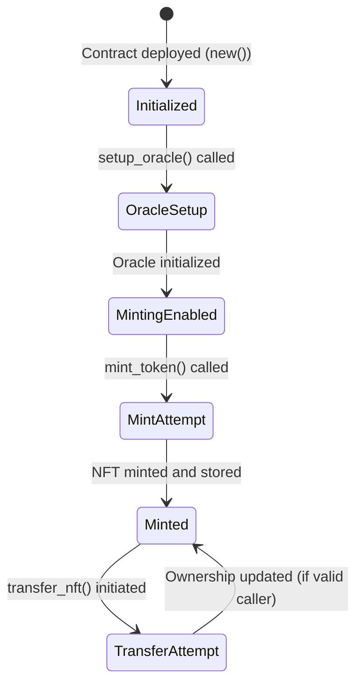
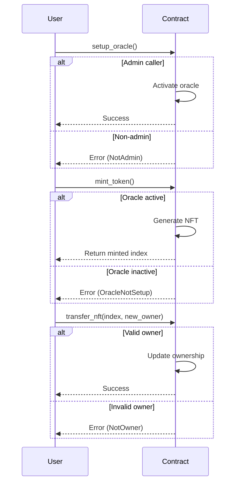

## Building a simple NFT Minting Machine

This contract allows you to mint NFTs with a unique identifier and manage their ownership. It provides a simple mechanism to initialize an oracle for tracking the NFT minting state and facilitates secure ownership transfer of minted NFTs.

### Key Features

| Feature                          | Description                                                              |
|----------------------------------|--------------------------------------------------------------------------|
| **Admin Control**                | The deployer of the contract is the admin and can initialize the oracle  |
| **NFT Minting**                  | Users can mint NFTs with automatically incremented token names           |
| **Ownership Transfer**           | Ownership of minted NFTs can be securely transferred                     |
| **Oracle Initialization**        | Admin initializes the oracle to enable minting                           |
| **NFT Retrieval**                | Retrieve details of a minted NFT by its unique index                     |

### Data Structures

| Component             | Type                         | Description                                                         |
|-----------------------|------------------------------|---------------------------------------------------------------------|
| **Nft**               | `struct`                     | Represents an NFT record with a token name and owner                |
| **OracleData**        | `struct`                     | Holds the current NFT mint counter                                  |
| **Error**             | `enum`                       | Custom error types for contract operations                          |
| **NFTMintingMachine** | `struct`                     | The main storage structure of the contract                          |

### Functions Overview

#### `new()` - Initializes the Contract

- **Key Points:**
  - Sets the deployer as admin  
  - Uses default values for storage  

#### `setup_oracle()` - Initializes the Oracle

- **Key Points:**
  - Only the **admin** can call this function  
  - Enables minting by setting up the oracle  

#### `mint_token()` - Mints a New NFT

- **Key Points:**  
  - Checks if the oracle is initialized  
  - Increments the NFT counter  
  - Generates a token name like "NFT #`counter`  
  - Registers the NFT with the caller as the owner  

#### `transfer_nft(nft_index: u64, new_owner: AccountId)` - Transfers Ownership

- **Key Points:**  
  - Verifies the caller is the current owner  
  - Updates the NFT record with the new owner  

#### `get_oracle_data()` - Retrieves Current Oracle Data

- **Key Points:**  
  - Returns the current NFT mint counter  

#### `get_nft(index: u64)` - Retrieves an NFT Record

- **Key Points:**  
  - Returns the NFT record if found  

### State Diagram



### Sequence Diagram



### Full Implementation

_lib.rs_

```rust
#![cfg_attr(not(feature = "std"), no_std, no_main)]

pub use self::nft_minting_machine::{NFTMintingMachine, Error};

/// The `nft_minting_machine` module defines a smart contract for minting NFTs using an oracle
/// token that tracks the current NFT index. The contract provides three primary actions:
/// - `setup_oracle`: A one-time function (admin-only) to initialize the oracle state.
/// - `mint_token`: Mints a new NFT with a token name that automatically increments based on a counter.
/// - `get_oracle_data`: Returns the current state of the oracle (the NFT mint counter).
#[ink::contract]
mod nft_minting_machine {
    use ink::storage::Mapping;
    use ink::prelude::string::{String, ToString};

    /// Represents an NFT record stored on-chain.
    /// Each NFT contains:
    /// - `token_name`: The generated name (including the incremented index).
    /// - `owner`: The AccountId of the minter.
    #[derive(scale::Encode, scale::Decode, Clone, Debug, PartialEq, Eq)]
    #[cfg_attr(feature = "std", derive(scale_info::TypeInfo, ink::storage::traits::StorageLayout))]
    pub struct Nft {
        token_name: String,
        owner: AccountId,
    }

    impl Nft {
        /// Returns the token name of the NFT.
        pub fn token_name(&self) -> &String {
            &self.token_name
        }

        /// Returns the owner of the NFT.
        pub fn owner(&self) -> &AccountId {
            &self.owner
        }
    }

    /// OracleData holds the current NFT counter.
    /// This is returned by the `get_oracle_data` function.
    #[derive(scale::Encode, scale::Decode, Clone, Debug, PartialEq, Eq)]
    #[cfg_attr(feature = "std", derive(scale_info::TypeInfo))]
    pub struct OracleData {
        pub current_index: u64,
    }

    /// Defines custom error types for the contract.
    /// These errors are returned when specific conditions are not met.
    #[derive(Debug, PartialEq, Eq, scale::Encode, scale::Decode)]
    #[cfg_attr(feature = "std", derive(scale_info::TypeInfo))]
    pub enum Error {
        /// The caller is not allowed to perform the action.
        NotAdmin = 0,
        /// The oracle has already been set up.
        OracleAlreadySet = 1,
        /// The oracle has not been initialized yet.
        OracleNotSetup = 2,
        /// A counter overflow occurred.
        CounterOverflow = 3,
        /// When an NFT with the specified index cannot be found.
        NFTNotFound = 4,
        /// When the caller is not the owner of the NFT.
        NotOwner = 5,
    }

    /// A type alias for the contract's result type.
    pub type Result<T> = core::result::Result<T, Error>;

    /// The `NFTMintingMachine` contract manages the minting of NFTs and tracks the minting state
    /// using a one-time oracle setup.
    #[ink(storage)]
    pub struct NFTMintingMachine {
        /// The administrator of the contract, typically the deployer.
        admin: AccountId,
        /// Flag indicating whether the oracle has been set up.
        oracle_setup: bool,
        /// The current NFT mint counter.
        oracle_index: u64,
        /// A mapping from NFT index to the NFT record.
        nfts: Mapping<u64, Nft>,
    }

    //----------------------------------
    // Default Implementation
    //----------------------------------

    impl Default for NFTMintingMachine {
        fn default() -> Self {
            Self {
                admin: AccountId::from([0u8; 32]),
                oracle_setup: false,
                oracle_index: 0,
                nfts: Mapping::default(),
            }
        }
    }

    //----------------------------------
    // Contract Implementation
    //----------------------------------

    impl NFTMintingMachine {
        /// Constructor: Initializes the contract with the deployer as the admin.
        #[ink(constructor)]
        pub fn new() -> Self {
            Self {
                admin: Self::env().caller(),
                ..Default::default()
            }
        }

        /// Transfers ownership of a minted NFT to a new owner.
        ///
        /// # Arguments
        /// - `nft_index`: The index of the NFT to transfer.
        /// - `new_owner`: The `AccountId` of the new owner.
        ///
        /// # Errors
        /// - Returns `Error::NFTNotFound` if the NFT doesn't exist.
        /// - Returns `Error::NotOwner` if the caller is not the current owner.
        #[ink(message)]
        pub fn transfer_nft(&mut self, nft_index: u64, new_owner: AccountId) -> Result<()> {
            let mut nft = self.nfts.get(nft_index).ok_or(Error::NFTNotFound)?;
            if self.env().caller() != nft.owner {
                return Err(Error::NotOwner);
            }
            nft.owner = new_owner;
            self.nfts.insert(nft_index, &nft);
            Ok(())
        }

        /// **Setup Oracle**
        ///
        /// Initializes the oracle by enabling the minting policy.
        /// This function is one‑time use and can only be called by the admin.
        ///
        /// # Errors
        /// - Returns `Error::NotAdmin` if the caller is not the admin.
        /// - Returns `Error::OracleAlreadySet` if the oracle has already been set up.
        #[ink(message)]
        pub fn setup_oracle(&mut self) -> Result<()> {
            if self.env().caller() != self.admin {
                return Err(Error::NotAdmin);
            }
            if self.oracle_setup {
                return Err(Error::OracleAlreadySet);
            }
            self.oracle_setup = true;
            self.oracle_index = 0;
            Ok(())
        }

        /// **Mint Token**
        ///
        /// Mints a new NFT. This function checks that the oracle has been set up, increments
        /// the NFT counter, creates a new NFT with a token name like "NFT #<counter>",
        /// and registers it with the caller as the owner.
        ///
        /// # Returns
        /// - The NFT's token index.
        ///
        /// # Errors
        /// - Returns `Error::OracleNotSetup` if the oracle has not been initialized.
        /// - Returns `Error::CounterOverflow` if incrementing the counter would overflow.
        #[ink(message)]
        pub fn mint_token(&mut self) -> Result<u64> {
            if !self.oracle_setup {
                return Err(Error::OracleNotSetup);
            }
            // Increment the NFT counter
            let next_index = self.oracle_index.checked_add(1).ok_or(Error::CounterOverflow)?;
            self.oracle_index = next_index;

            // Generate the NFT token name based on the new index
            let mut token_name = String::from("NFT #");
            let index_str = next_index.to_string(); // `to_string` now works because `ToString` is imported
            token_name.push_str(&index_str);

            let nft = Nft {
                token_name,
                owner: self.env().caller(),
            };
            self.nfts.insert(next_index, &nft);
            Ok(next_index)
        }

        /// **Get Oracle Data**
        ///
        /// Returns the current oracle data showing the state and the NFT mint counter.
        #[ink(message)]
        pub fn get_oracle_data(&self) -> OracleData {
            OracleData {
                current_index: self.oracle_index,
            }
        }

        /// (Optional) Retrieve a minted NFT by its index.
        #[ink(message)]
        pub fn get_nft(&self, index: u64) -> Option<Nft> {
            self.nfts.get(index)
        }
    }
}

```

_Cargo.toml_

```toml
[package]
name = "nft_minting_machine"
version = "0.1.0"
authors = ["[your_name] <[your_email]>"]
edition = "2021"

[dependencies]
ink = { version = "5.1.1", default-features = false }
scale = { package = "parity-scale-codec", version = "3.7.4", default-features = false, features = ["derive"] }
scale-info = { version = "2.11.6", default-features = false, features = ["derive"], optional = true }

[dev-dependencies]
ink_e2e = { version = "5.1.1" }

[lib]
path = "lib.rs"

[features]
default = ["std"]
std = [
    "ink/std",
    "scale/std",
    "scale-info/std",
]
ink-as-dependency = []
e2e-tests = []

```

### Test Scenarios

_./tests/tests.rs_

```rust
#![cfg_attr(not(feature = "std"), no_std, no_main)]

pub use self::nft_minting_machine::{NFTMintingMachine, Error};

/// The `nft_minting_machine` module defines a smart contract for minting NFTs using an oracle
/// token that tracks the current NFT index. The contract provides three primary actions:
/// - `setup_oracle`: A one-time function (admin-only) to initialize the oracle state.
/// - `mint_token`: Mints a new NFT with a token name that automatically increments based on a counter.
/// - `get_oracle_data`: Returns the current state of the oracle (the NFT mint counter).
#[ink::contract]
mod nft_minting_machine {
    use ink::storage::Mapping;
    use ink::prelude::string::{String, ToString};

    /// Represents an NFT record stored on-chain.
    /// Each NFT contains:
    /// - `token_name`: The generated name (including the incremented index).
    /// - `owner`: The AccountId of the minter.
    #[derive(scale::Encode, scale::Decode, Clone, Debug, PartialEq, Eq)]
    #[cfg_attr(feature = "std", derive(scale_info::TypeInfo, ink::storage::traits::StorageLayout))]
    pub struct Nft {
        token_name: String,
        owner: AccountId,
    }

    impl Nft {
        /// Returns the token name of the NFT.
        pub fn token_name(&self) -> &String {
            &self.token_name
        }

        /// Returns the owner of the NFT.
        pub fn owner(&self) -> &AccountId {
            &self.owner
        }
    }

    /// OracleData holds the current NFT counter.
    /// This is returned by the `get_oracle_data` function.
    #[derive(scale::Encode, scale::Decode, Clone, Debug, PartialEq, Eq)]
    #[cfg_attr(feature = "std", derive(scale_info::TypeInfo))]
    pub struct OracleData {
        pub current_index: u64,
    }

    /// Defines custom error types for the contract.
    /// These errors are returned when specific conditions are not met.
    #[derive(Debug, PartialEq, Eq, scale::Encode, scale::Decode)]
    #[cfg_attr(feature = "std", derive(scale_info::TypeInfo))]
    pub enum Error {
        /// The caller is not allowed to perform the action.
        NotAdmin = 0,
        /// The oracle has already been set up.
        OracleAlreadySet = 1,
        /// The oracle has not been initialized yet.
        OracleNotSetup = 2,
        /// A counter overflow occurred.
        CounterOverflow = 3,
        /// When an NFT with the specified index cannot be found.
        NFTNotFound = 4,
        /// When the caller is not the owner of the NFT.
        NotOwner = 5,
    }

    /// A type alias for the contract's result type.
    pub type Result<T> = core::result::Result<T, Error>;

    /// The `NFTMintingMachine` contract manages the minting of NFTs and tracks the minting state
    /// using a one-time oracle setup.
    #[ink(storage)]
    pub struct NFTMintingMachine {
        /// The administrator of the contract, typically the deployer.
        admin: AccountId,
        /// Flag indicating whether the oracle has been set up.
        oracle_setup: bool,
        /// The current NFT mint counter.
        oracle_index: u64,
        /// A mapping from NFT index to the NFT record.
        nfts: Mapping<u64, Nft>,
    }

    //----------------------------------
    // Default Implementation
    //----------------------------------

    impl Default for NFTMintingMachine {
        fn default() -> Self {
            Self {
                admin: AccountId::from([0u8; 32]),
                oracle_setup: false,
                oracle_index: 0,
                nfts: Mapping::default(),
            }
        }
    }

    //----------------------------------
    // Contract Implementation
    //----------------------------------

    impl NFTMintingMachine {
        /// Constructor: Initializes the contract with the deployer as the admin.
        #[ink(constructor)]
        pub fn new() -> Self {
            Self {
                admin: Self::env().caller(),
                ..Default::default()
            }
        }

        /// Transfers ownership of a minted NFT to a new owner.
        ///
        /// # Arguments
        /// - `nft_index`: The index of the NFT to transfer.
        /// - `new_owner`: The `AccountId` of the new owner.
        ///
        /// # Errors
        /// - Returns `Error::NFTNotFound` if the NFT doesn't exist.
        /// - Returns `Error::NotOwner` if the caller is not the current owner.
        #[ink(message)]
        pub fn transfer_nft(&mut self, nft_index: u64, new_owner: AccountId) -> Result<()> {
            let mut nft = self.nfts.get(nft_index).ok_or(Error::NFTNotFound)?;
            if self.env().caller() != nft.owner {
                return Err(Error::NotOwner);
            }
            nft.owner = new_owner;
            self.nfts.insert(nft_index, &nft);
            Ok(())
        }

        /// **Setup Oracle**
        ///
        /// Initializes the oracle by enabling the minting policy.
        /// This function is one‑time use and can only be called by the admin.
        ///
        /// # Errors
        /// - Returns `Error::NotAdmin` if the caller is not the admin.
        /// - Returns `Error::OracleAlreadySet` if the oracle has already been set up.
        #[ink(message)]
        pub fn setup_oracle(&mut self) -> Result<()> {
            if self.env().caller() != self.admin {
                return Err(Error::NotAdmin);
            }
            if self.oracle_setup {
                return Err(Error::OracleAlreadySet);
            }
            self.oracle_setup = true;
            self.oracle_index = 0;
            Ok(())
        }

        /// **Mint Token**
        ///
        /// Mints a new NFT. This function checks that the oracle has been set up, increments
        /// the NFT counter, creates a new NFT with a token name like "NFT #<counter>",
        /// and registers it with the caller as the owner.
        ///
        /// # Returns
        /// - The NFT's token index.
        ///
        /// # Errors
        /// - Returns `Error::OracleNotSetup` if the oracle has not been initialized.
        /// - Returns `Error::CounterOverflow` if incrementing the counter would overflow.
        #[ink(message)]
        pub fn mint_token(&mut self) -> Result<u64> {
            if !self.oracle_setup {
                return Err(Error::OracleNotSetup);
            }
            // Increment the NFT counter
            let next_index = self.oracle_index.checked_add(1).ok_or(Error::CounterOverflow)?;
            self.oracle_index = next_index;

            // Generate the NFT token name based on the new index
            let mut token_name = String::from("NFT #");
            let index_str = next_index.to_string(); // `to_string` now works because `ToString` is imported
            token_name.push_str(&index_str);

            let nft = Nft {
                token_name,
                owner: self.env().caller(),
            };
            self.nfts.insert(next_index, &nft);
            Ok(next_index)
        }

        /// **Get Oracle Data**
        ///
        /// Returns the current oracle data showing the state and the NFT mint counter.
        #[ink(message)]
        pub fn get_oracle_data(&self) -> OracleData {
            OracleData {
                current_index: self.oracle_index,
            }
        }

        /// (Optional) Retrieve a minted NFT by its index.
        #[ink(message)]
        pub fn get_nft(&self, index: u64) -> Option<Nft> {
            self.nfts.get(index)
        }
    }
}

```
