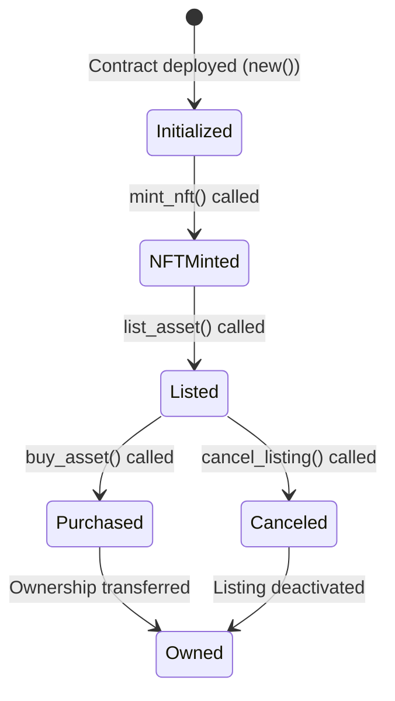
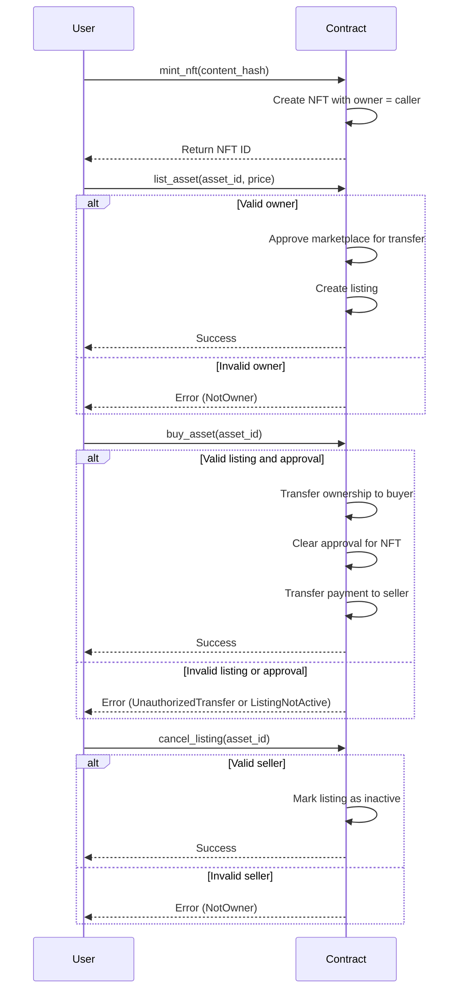

## Building a simple NFT MarketPlace

This contract implements a decentralized NFT marketplace where users can list, buy, and manage NFTs. It provides a secure mechanism for transferring ownership of NFTs during a sale and ensures that only authorized accounts can perform specific actions.

### Key Features

| Feature                          | Description                                                              |
|----------------------------------|--------------------------------------------------------------------------|
| **NFT Minting**                  | Users can mint unique NFTs with a content hash                           |
| **NFT Listing**                  | Owners can list their NFTs for sale with a specified price               |
| **NFT Purchase**                 | Ownership of NFTs is securely transferred to the buyer upon purchase     |
| **Approval Mechanism**           | Ensures only approved accounts (e.g., the marketplace) can transfer NFTs |
| **Listing Management**           | Owners can cancel active listings at any time                            |

### Data Structures

| Component             | Type                         | Description                                                         |
|-----------------------|------------------------------|---------------------------------------------------------------------|
| **Content**           | `struct`                     | Represents an NFT with its owner, content hash, and approval status |
| **Listing**           | `struct`                     | Represents an NFT listing with price, seller, and active status     |
| **Error**             | `enum`                       | Custom error types for contract operations                          |
| **NFTMarketplace**    | `struct`                     | The main storage structure of the contract                          |

### Functions Overview

#### `new()` - Initializes the Contract

- **Key Points:**
  - Sets up the contract with default values for storage  

#### `mint_nft(content_hash: String)` - Mints a New NFT

- **Key Points:**  
  - Creates a new NFT with a unique content hash  
  - Assigns the caller as the owner  

#### `approve(asset_id: u64, approved: AccountId)` - Approves an Account

- **Key Points:**  
  - Allows the owner to approve an account to transfer the NFT  
  - Used internally to approve the marketplace for handling sales  

#### `list_asset(asset_id: u64, price: Balance)` - Lists an NFT for Sale

- **Key Points:**  
  - Verifies the caller is the owner of the NFT  
  - Approves the marketplace to transfer the NFT  
  - Creates a listing with the specified price  

#### `buy_asset(asset_id: u64)` - Buys an NFT

- **Key Points:**  
  - Verifies the listing is active and the marketplace is approved  
  - Transfers ownership of the NFT to the buyer  
  - Transfers the payment to the seller  

#### `cancel_listing(asset_id: u64)` - Cancels an Active Listing

- **Key Points:**  
  - Verifies the caller is the seller  
  - Marks the listing as inactive  

#### `get_content(asset_id: u64)` - Retrieves NFT Details

- **Key Points:**  
  - Returns the details of an NFT, including its owner and approval status  

#### `get_listing(asset_id: u64)` - Retrieves Listing Details

- **Key Points:**  
  - Returns the details of an active listing  

### State Diagram



### Sequence Diagram



### Full Implementation

_lib.rs_

```rust
#![cfg_attr(not(feature = "std"), no_std, no_main)]

pub use self::nft_marketplace::{NFTMarketplace, Error};
#[ink::contract]
mod nft_marketplace {
    use ink::storage::Mapping;
    use ink::prelude::string::String;
    use ink::prelude::collections::BTreeMap;

    /// NFT content with ownership and approval
    ///
    /// The `Content` struct represents an NFT in the marketplace. It includes:
    /// - `content_hash`: A unique hash representing the content of the NFT.
    /// - `owner`: The account ID of the current owner of the NFT.
    /// - `approved`: An optional field that specifies which account is approved to transfer the NFT.
    ///   - `Some(AccountId)`: Indicates that the specified account is approved to transfer the NFT.
    ///   - `None`: Indicates that no account is approved to transfer the NFT.
    ///
    /// The `approved` field is used to ensure that only authorized accounts (e.g., the marketplace contract)
    /// can transfer the NFT on behalf of the owner. This is a standard mechanism in NFT contracts to
    /// provide flexibility and security.
    #[derive(scale::Encode, scale::Decode, Clone, Debug, PartialEq, Eq)]
    #[cfg_attr(feature = "std", derive(scale_info::TypeInfo, ink::storage::traits::StorageLayout))]
    pub struct Content {
        pub content_hash: String,
        pub owner: AccountId,
        pub approved: Option<AccountId>, // Specifies the approved account for transfers
    }

    /// Marketplace listing structure
    ///
    /// The `Listing` struct represents an NFT that is listed for sale in the marketplace. It includes:
    /// - `asset_id`: The ID of the NFT being listed.
    /// - `seller`: The account ID of the seller.
    /// - `price`: The price at which the NFT is listed.
    /// - `is_active`: A boolean indicating whether the listing is active.
    #[derive(scale::Encode, scale::Decode, Clone, Debug, PartialEq, Eq)]
    #[cfg_attr(feature = "std", derive(scale_info::TypeInfo, ink::storage::traits::StorageLayout))]
    pub struct Listing {
        pub asset_id: u64,
        pub seller: AccountId,
        pub price: Balance,
        pub is_active: bool,
    }

    /// Event emitted when NFT is listed
    #[ink(event)]
    pub struct AssetListed {
        #[ink(topic)]
        asset_id: u64,
        seller: AccountId,
        price: Balance,
    }

    /// Event emitted when NFT is sold
    #[ink(event)]
    pub struct AssetSold {
        #[ink(topic)]
        asset_id: u64,
        seller: AccountId,
        buyer: AccountId,
        price: Balance,
    }

    /// Event emitted when listing is updated
    #[ink(event)]
    pub struct ListingUpdated {
        #[ink(topic)]
        asset_id: u64,
        new_price: Balance,
    }

    /// Event emitted when listing is canceled
    #[ink(event)]
    pub struct ListingCanceled {
        #[ink(topic)]
        asset_id: u64,
    }

    #[derive(Debug, PartialEq, Eq, scale::Encode, scale::Decode)]
    #[cfg_attr(feature = "std", derive(scale_info::TypeInfo))]
    pub enum Error {
        NotAdmin = 0,
        ContentNotFound = 1,
        NotOwner = 2,
        CounterOverflow = 3,
        InvalidContent = 4,
        AssetAlreadyListed = 5,
        ListingNotFound = 6,
        ListingNotActive = 7,
        InvalidPrice = 8,
        TransferFailed = 9,
        UnauthorizedTransfer = 10,
    }

    pub type Result<T> = core::result::Result<T, Error>;

    #[ink(storage)]
    pub struct NFTMarketplace {
        pub admin: AccountId,
        contents: Mapping<u64, Content>,
        next_content_id: u64,
        content_hash_to_id: BTreeMap<String, u64>,
        listings: Mapping<u64, Listing>,
    }

    impl Default for NFTMarketplace {
        fn default() -> Self {
            Self {
                admin: AccountId::from([0u8; 32]),
                contents: Mapping::default(),
                next_content_id: 1,
                content_hash_to_id: BTreeMap::new(),
                listings: Mapping::default(),
            }
        }
    }

    impl NFTMarketplace {
        /// Constructor to initialize the contract with the caller as the admin.
        #[ink(constructor)]
        pub fn new() -> Self {
            Self {
                admin: Self::env().caller(),
                ..Default::default()
            }
        }


        /// Mints a new NFT with the given content hash.
        /// 
        /// # Parameters
        /// - `content_hash`: A unique hash representing the content of the NFT.
        /// 
        /// # Returns
        /// - `Ok(content_id)` with the ID of the newly minted NFT.
        /// - `Err(Error::CounterOverflow)` if the `next_content_id` exceeds the maximum value.
        #[ink(message)]
        pub fn mint_nft(&mut self, content_hash: String) -> Result<u64> {
            if let Some(existing_id) = self.content_hash_to_id.get(&content_hash) {
                return Ok(*existing_id);
            }

            let content_id = self.next_content_id;
            self.next_content_id = self.next_content_id
                .checked_add(1)
                .ok_or(Error::CounterOverflow)?;

            let record = Content {
                content_hash: content_hash.clone(),
                owner: self.env().caller(),
                approved: None,
            };

            self.contents.insert(content_id, &record);
            self.content_hash_to_id.insert(content_hash, content_id);
            Ok(content_id)
        }

        /// Internal function to transfer ownership of an NFT without permission checks.
        /// 
        /// # Parameters
        /// - `asset_id`: The ID of the NFT to transfer.
        /// - `new_owner`: The account ID of the new owner.
        /// 
        /// # Returns
        /// - `Ok(())` if the transfer is successful.
        /// - `Err(Error::ContentNotFound)` if the NFT does not exist.
        fn _transfer_ownership(&mut self, asset_id: u64, new_owner: AccountId) -> Result<()> {
            let mut content = self.contents.get(asset_id).ok_or(Error::ContentNotFound)?;
            content.owner = new_owner;
            content.approved = None;
            self.contents.insert(asset_id, &content);
            Ok(())
        }

        /// Cancels an active listing for an NFT.
        /// 
        /// # Parameters
        /// - `asset_id`: The ID of the NFT whose listing is to be canceled.
        /// 
        /// # Returns
        /// - `Ok(())` if the cancellation is successful.
        /// - `Err(Error::ListingNotFound)` if the listing does not exist.
        /// - `Err(Error::NotOwner)` if the caller is not the seller of the listing.
        /// - `Err(Error::ListingNotActive)` if the listing is not active.
        #[ink(message)]
        pub fn cancel_listing(&mut self, asset_id: u64) -> Result<()> {
            let mut listing = self.listings.get(asset_id).ok_or(Error::ListingNotFound)?;

            if self.env().caller() != listing.seller {
                return Err(Error::NotOwner);
            }

            if !listing.is_active {
                return Err(Error::ListingNotActive);
            }

            listing.is_active = false;
            self.listings.insert(asset_id, &listing);

            // Revoke contract approval if it exists
            let mut content = self.contents.get(asset_id).ok_or(Error::ContentNotFound)?;
            content.approved = None;
            self.contents.insert(asset_id, &content);

            self.env().emit_event(ListingCanceled { asset_id });

            Ok(())
        }

        /// Approves an account to transfer the specified NFT.
        ///
        /// The `approve` function allows the owner of an NFT to grant permission to another account
        /// to transfer the NFT on their behalf. This is commonly used to allow the marketplace contract
        /// to handle NFT transfers during a sale.
        ///
        /// # Parameters
        /// - `asset_id`: The ID of the NFT to approve.
        /// - `approved`: The account ID to approve.
        ///
        /// # Returns
        /// - `Ok(())` if the approval is successful.
        /// - `Err(Error::ContentNotFound)` if the NFT does not exist.
        /// - `Err(Error::NotOwner)` if the caller is not the owner of the NFT.
        ///
        /// # Notes
        /// - The `approved` field in the `Content` struct will be set to `Some(approved)` to indicate
        ///   that the specified account is approved.
        /// - If the NFT is sold or the listing is canceled, the `approved` field will be cleared (set to `None`).
        #[ink(message)]
        pub fn approve(&mut self, asset_id: u64, approved: AccountId) -> Result<()> {
            let mut content = self.contents.get(asset_id).ok_or(Error::ContentNotFound)?;

            if self.env().caller() != content.owner {
                return Err(Error::NotOwner);
            }

            content.approved = Some(approved);
            self.contents.insert(asset_id, &content);
            Ok(())
        }

        /// Lists an NFT for sale at the specified price.
        ///
        /// The `list_asset` function allows the owner of an NFT to list it for sale in the marketplace.
        /// During this process, the marketplace contract is automatically approved to transfer the NFT
        /// on behalf of the owner.
        ///
        /// # Parameters
        /// - `asset_id`: The ID of the NFT to list.
        /// - `price`: The price at which the NFT is listed.
        ///
        /// # Returns
        /// - `Ok(())` if the listing is successful.
        /// - `Err(Error::ContentNotFound)` if the NFT does not exist.
        /// - `Err(Error::NotOwner)` if the caller is not the owner of the NFT.
        /// - `Err(Error::InvalidPrice)` if the price is zero.
        /// - `Err(Error::AssetAlreadyListed)` if the NFT is already listed.
        ///
        /// # Notes
        /// - The `approved` field in the `Content` struct will be set to `Some(self.env().account_id())`
        ///   to allow the marketplace contract to transfer the NFT during the sale.
        /// - If the listing is canceled or the NFT is sold, the `approved` field will be cleared.
        #[ink(message)]
        pub fn list_asset(&mut self, asset_id: u64, price: Balance) -> Result<()> {
            if price == 0 {
                return Err(Error::InvalidPrice);
            }

            let mut content = self.contents.get(asset_id).ok_or(Error::ContentNotFound)?;
            let caller = self.env().caller();

            if caller != content.owner {
                return Err(Error::NotOwner);
            }

            if let Some(existing) = self.listings.get(asset_id) {
                if existing.is_active {
                    return Err(Error::AssetAlreadyListed);
                }
            }

            // Approve the contract to handle transfers
            content.approved = Some(self.env().account_id());
            self.contents.insert(asset_id, &content);

            let listing = Listing {
                asset_id,
                seller: caller,
                price,
                is_active: true,
            };

            self.listings.insert(asset_id, &listing);
            self.env().emit_event(AssetListed {
                asset_id,
                seller: caller,
                price,
            });

            Ok(())
        }

        /// Buys an NFT from the marketplace.
        ///
        /// The `buy_asset` function allows a buyer to purchase an NFT that is listed for sale.
        /// The function validates the listing, ensures the buyer has transferred sufficient funds,
        /// and transfers ownership of the NFT to the buyer.
        ///
        /// # Parameters
        /// - `asset_id`: The ID of the NFT to buy.
        ///
        /// # Returns
        /// - `Ok(())` if the purchase is successful.
        /// - `Err(Error::ListingNotFound)` if the listing does not exist.
        /// - `Err(Error::ListingNotActive)` if the listing is not active.
        /// - `Err(Error::UnauthorizedTransfer)` if the marketplace contract is not approved to transfer the NFT.
        /// - `Err(Error::InvalidPrice)` if the transferred value is less than the listing price.
        /// - `Err(Error::NotOwner)` if the buyer is already the owner of the NFT.
        ///
        /// # Notes
        /// - The `approved` field in the `Content` struct is validated to ensure the marketplace contract
        ///   is authorized to transfer the NFT.
        /// - After the purchase, the `approved` field is cleared (set to `None`).
        #[ink(message, payable)]
        pub fn buy_asset(&mut self, asset_id: u64) -> Result<()> {
            let mut listing = self.listings.get(asset_id).ok_or(Error::ListingNotFound)?;
            let mut content = self.contents.get(asset_id).ok_or(Error::ContentNotFound)?;
            let caller = self.env().caller();
            let transferred = self.env().transferred_value();

            // Prevent the owner from buying their own NFT
            if caller == content.owner {
                return Err(Error::NotOwner);
            }

            // Validate listing state
            if !listing.is_active {
                return Err(Error::ListingNotActive);
            }

            // Validate approval
            if content.approved != Some(self.env().account_id()) {
                return Err(Error::UnauthorizedTransfer);
            }

            // Validate payment
            if transferred < listing.price {
                return Err(Error::InvalidPrice);
            }

            // Update state FIRST
            listing.is_active = false;
            self.listings.insert(asset_id, &listing);

            // Transfer NFT ownership internally
            content.owner = caller;
            content.approved = None; // Clear approval after transfer
            self.contents.insert(asset_id, &content);

            // Handle funds
            let excess = transferred.checked_sub(listing.price).ok_or(Error::TransferFailed)?;

            // Transfer payment to seller
            self.env()
                .transfer(listing.seller, listing.price)
                .map_err(|_| Error::TransferFailed)?;

            // Refund excess
            if excess > 0 {
                self.env()
                    .transfer(caller, excess)
                    .map_err(|_| Error::TransferFailed)?;
            }

            self.env().emit_event(AssetSold {
                asset_id,
                seller: listing.seller,
                buyer: caller,
                price: listing.price,
            });

            Ok(())
        }

        #[ink(message)]
        pub fn update_listing(&mut self, asset_id: u64, new_price: Balance) -> Result<()> {
            if new_price == 0 {
                return Err(Error::InvalidPrice);
            }

            let mut listing = self.listings.get(asset_id).ok_or(Error::ListingNotFound)?;

            if self.env().caller() != listing.seller {
                return Err(Error::NotOwner);
            }

            if !listing.is_active {
                return Err(Error::ListingNotActive);
            }

            listing.price = new_price;
            self.listings.insert(asset_id, &listing);

            self.env().emit_event(ListingUpdated {
                asset_id,
                new_price,
            });

            Ok(())
        }

        /// Retrieves the details of an NFT.
        /// 
        /// # Parameters
        /// - `asset_id`: The ID of the NFT to retrieve.
        /// 
        /// # Returns
        /// - `Some(Content)` if the NFT exists.
        /// - `None` if the NFT does not exist.
        #[ink(message)]
        pub fn get_content(&self, asset_id: u64) -> Option<Content> {
            self.contents.get(asset_id)
        }

        /// Retrieves the details of a listing.
        /// 
        /// # Parameters
        /// - `asset_id`: The ID of the NFT whose listing is to be retrieved.
        /// 
        /// # Returns
        /// - `Some(Listing)` if the listing exists.
        /// - `None` if the listing does not exist.
        #[ink(message)]
        pub fn get_listing(&self, asset_id: u64) -> Option<Listing> {
            self.listings.get(asset_id)
        }
    }
}

```

_Cargo.toml_

```toml
[package]
name = "nft_marketplace"
version = "0.1.0"
authors = ["[your_name] <[your_email]>"]
edition = "2021"

[dependencies]
ink = { version = "5.1.1", default-features = false }
scale = { package = "parity-scale-codec", version = "3.7.4", default-features = false, features = ["derive"] }
scale-info = { version = "2.11.6", default-features = false, features = ["derive"], optional = true }

[dev-dependencies]
ink_e2e = { version = "5.1.1" }

[lib]
path = "lib.rs"

[features]
default = ["std"]
std = [
    "ink/std",
    "scale/std",
    "scale-info/std",
]
ink-as-dependency = []
e2e-tests = []

```

### Test Scenarios

_./tests/tests.rs_

```rust
/// # NFTMarketplace Contract Test Suite
///
/// This module contains comprehensive tests for the `NFTMarketplace` contract,
/// covering core functionality, edge cases, and security requirements.
///
/// ## Test Accounts Convention:
/// - **Alice**: Default caller/initiator (ink! default account)
/// - **Bob**: Counterparty account
/// - **Charlie**: Unauthorized third party
#[cfg(test)]
mod tests {
    use nft_marketplace::{NFTMarketplace, Error};
    use ink::env::{test, DefaultEnvironment};

    /// Tests the initialization of the contract.
    /// - Verifies that the `admin` field is set to the account that deployed the contract.
    #[ink::test]
    fn test_new_contract() {
        let accounts = test::default_accounts::<DefaultEnvironment>();
        let marketplace = NFTMarketplace::new();

        assert_eq!(marketplace.admin, accounts.alice);
    }

    /// Tests the minting of a new NFT.
    /// - Verifies that a new NFT is created with the correct `content_hash`.
    /// - Verifies that the NFT is owned by the caller.
    #[ink::test]
    fn test_mint_nft() {
        let mut marketplace = NFTMarketplace::new();
        let content_hash = String::from("unique_hash");

        let result = marketplace.mint_nft(content_hash.clone());
        assert!(result.is_ok());
        let content_id = result.unwrap();

        let content = marketplace.get_content(content_id);
        assert!(content.is_some());
        assert_eq!(content.unwrap().content_hash, content_hash);
    }

    /// Tests listing an NFT for sale.
    /// - Verifies that the NFT is listed with the correct price and seller information.
    /// - Verifies that the listing is marked as active.
    #[ink::test]
    fn test_list_asset() {
        let mut marketplace = NFTMarketplace::new();
        let accounts = test::default_accounts::<DefaultEnvironment>();
        let content_hash = String::from("unique_hash");

        let content_id = marketplace.mint_nft(content_hash).unwrap();
        let price = 100;

        let result = marketplace.list_asset(content_id, price);
        assert!(result.is_ok());

        let listing = marketplace.get_listing(content_id);
        assert!(listing.is_some());
        let listing = listing.unwrap();
        assert_eq!(listing.price, price);
        assert_eq!(listing.seller, accounts.alice);
        assert!(listing.is_active);
    }

    /// Tests canceling an active listing.
    /// - Verifies that the listing is marked as inactive after cancellation.
    #[ink::test]
    fn test_cancel_listing() {
        let mut marketplace = NFTMarketplace::new();
        let content_hash = String::from("unique_hash");

        let content_id = marketplace.mint_nft(content_hash).unwrap();
        marketplace.list_asset(content_id, 100).unwrap();

        let result = marketplace.cancel_listing(content_id);
        assert!(result.is_ok());

        let listing = marketplace.get_listing(content_id);
        assert!(listing.is_some());
        assert!(!listing.unwrap().is_active);
    }

    /// Tests buying an NFT.
    /// - Verifies that the ownership of the NFT is transferred to the buyer.
    /// - Verifies that the listing is deactivated after the purchase.
    #[ink::test]
    fn test_buy_asset() {
        let mut marketplace = NFTMarketplace::new();
        let accounts = test::default_accounts::<DefaultEnvironment>();
        let content_hash = String::from("unique_hash");

        let content_id = marketplace.mint_nft(content_hash).unwrap();
        marketplace.list_asset(content_id, 100).unwrap();

        test::set_caller::<DefaultEnvironment>(accounts.bob);
        test::set_value_transferred::<DefaultEnvironment>(100);

        let result = marketplace.buy_asset(content_id);
        assert!(result.is_ok());

        let content = marketplace.get_content(content_id).unwrap();
        assert_eq!(content.owner, accounts.bob);

        let listing = marketplace.get_listing(content_id);
        assert!(listing.is_some());
        assert!(!listing.unwrap().is_active);
    }

    /// Tests the `approve` function.
    /// - Verifies that an account can be approved to transfer an NFT.
    /// - Verifies that only the owner can approve an account.
    #[ink::test]
    fn test_approve() {
        let mut marketplace = NFTMarketplace::new();
        let accounts = test::default_accounts::<DefaultEnvironment>();
        let content_hash = String::from("unique_hash");

        let content_id = marketplace.mint_nft(content_hash).unwrap();

        // Approve Bob to transfer the NFT
        let result = marketplace.approve(content_id, accounts.bob);
        assert!(result.is_ok());

        // Set caller to Charlie (unauthorized third party)
        test::set_caller::<DefaultEnvironment>(accounts.charlie);

        // Attempt to approve another account (should fail)
        let result = marketplace.approve(content_id, accounts.charlie);
        assert_eq!(result, Err(Error::NotOwner));
    }

    /// Tests the `update_listing` function.
    /// - Verifies that the price of an active listing can be updated.
    /// - Verifies that only the seller can update the listing.
    #[ink::test]
    fn test_update_listing() {
        let mut marketplace = NFTMarketplace::new();
        let accounts = test::default_accounts::<DefaultEnvironment>();
        let content_hash = String::from("unique_hash");

        let content_id = marketplace.mint_nft(content_hash).unwrap();
        marketplace.list_asset(content_id, 100).unwrap();

        // Update the listing price
        let new_price = 150;
        let result = marketplace.update_listing(content_id, new_price);
        assert!(result.is_ok());

        let listing = marketplace.get_listing(content_id).unwrap();
        assert_eq!(listing.price, new_price);

        // Set caller to Bob (unauthorized user)
        test::set_caller::<DefaultEnvironment>(accounts.bob);

        // Attempt to update the listing (should fail)
        let result = marketplace.update_listing(content_id, 200);
        assert_eq!(result, Err(Error::NotOwner));
    }

    /// Tests unauthorized actions by a third party.
    /// - Verifies that a third party cannot cancel a listing.
    #[ink::test]
    fn test_unauthorized_actions() {
        let mut marketplace = NFTMarketplace::new();
        let accounts = test::default_accounts::<DefaultEnvironment>();
        let content_hash = String::from("unique_hash");

        // Mint an NFT and list it for sale
        let content_id = marketplace.mint_nft(content_hash).unwrap();
        marketplace.list_asset(content_id, 100).unwrap();

        // Set caller to Charlie (unauthorized third party)
        test::set_caller::<DefaultEnvironment>(accounts.charlie);

        // Attempt to cancel the listing (should fail)
        let cancel_result = marketplace.cancel_listing(content_id);
        assert_eq!(cancel_result, Err(Error::NotOwner));
    }

    /// Tests that the owner cannot buy their own NFT.
    /// - Verifies that the owner cannot buy their own NFT.
    #[ink::test]
    fn test_owner_cannot_buy_own_nft() {
        let mut marketplace = NFTMarketplace::new();
        let accounts = test::default_accounts::<DefaultEnvironment>();
        let content_hash = String::from("unique_hash");

        // Mint and list an NFT
        let content_id = marketplace.mint_nft(content_hash).unwrap();
        marketplace.list_asset(content_id, 100).unwrap();

        // Set caller to the owner (Alice)
        test::set_caller::<DefaultEnvironment>(accounts.alice);
        test::set_value_transferred::<DefaultEnvironment>(100);

        // Attempt to buy the NFT (should fail)
        let result = marketplace.buy_asset(content_id);
        assert_eq!(result, Err(Error::NotOwner));
    }
}

```
